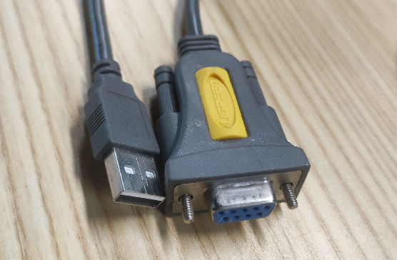
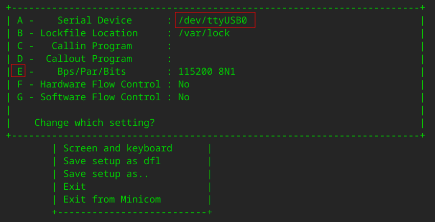

# 设计文档

# 目录

[TOC]


# OS无关部分

UEFI

ACPI

​	https://www.docin.com/p-61605088.html

EC固件

IPLC


# OS相关部分

## 内核无关部分

### 构建环境搭建

#### 虚拟机构建linux发行版环境

虚拟机配置两块磁盘，主磁盘20G大小（用来安装ubuntu系统，构造前期准备环境）、副磁盘40G+大小（越大越好，用来构建lfs环境）。副磁盘/dev/vdb用于lfs构建，建议**大小为40G+**（越大越好），linux内核编译比较耗费空间(20多G) 。

推荐使用ubuntu作为虚拟机iso镜像。iso下载地址[https://ubuntu.com/download/desktop/thank-you/?version=20.10&architecture=amd64](https://ubuntu.com/download/desktop/thank-you/?version=20.10&architecture=amd64)
安装ubuntu系统,可以使用最小安装节省安装时间.

#副磁盘，磁盘分区规划为grub分区 300M, 交换分区2G, 其余的作为lfs构建分区。
虚拟机安装完成后,查看虚拟机中是否有vdb设备：

```
ls /dev/vdb
```

注：这里使用的磁盘总线类型都是VIRTIO，不是SATA。所以ubuntu20.10中的新增磁盘设备名不是/dev/sdb，是/dev/vdb。

#### 准备宿主环境

虚拟机安装OS成功后，进入终端。

#虚拟机ubuntu系统中安装如下工具

```
sudo apt update && sudo apt install git make vim -y
```

#下载haoos仓库

```
git clone https://github.com/chaoshuaihaohao/haoos-lfs.git
```

#下载关联的lfs仓库

```
cd ~/haoos-lfs/
git clone git://git.linuxfromscratch.org/lfs.git lfs-git
```

如果要构建blfs系统，下载如下仓库

```
cd ~/haoos-lfs/
git clone git://git.linuxfromscratch.org/blfs.git blfs-git
```

#os-build解析并下载相关软件包

```
./os-build/build.sh
#生成build目录并下载所需的各个软件包源码和patch
#打补丁
find ./build -name *.cmd | xargs sed -i 's/make check/#make check/g'
find ./build -name *.cmd | xargs sed -i 's/make -j1 check/#make -j1 check/g'
find ./build -name *.cmd | xargs sed -i 's/make -j4 check/#make -j4 check/g'
find ./build -name *.cmd | xargs sed -i 's/make test/#make test/g'
```

#检查宿主机器的环境，针对结果安装不同的包#todo:新增脚本对bash -e ./build/cmd/hostreqs.cmd的输出进行检测，然后下载所需的依赖包

```
bash -e ./build/cmd/hostreqs.cmd
```

#安装依赖的软件包（TODO这个后续去掉/修改）

```
cd ~/haoos-lfs/
sudo make dep-install
```

#### LFS构建环境

##### LFS磁盘分区介绍

注意：通过fdisk -l查看，宿主虚拟机的分区如下:

```vb
Disk /dev/vda：15 GiB，16106127360 字节，31457280 个扇区
单元：扇区 / 1 * 512 = 512 字节
扇区大小(逻辑/物理)：512 字节 / 512 字节
I/O 大小(最小/最佳)：512 字节 / 512 字节
磁盘标签类型：gpt
磁盘标识符：D6D29393-0ABB-4E45-8EC3-32021B8980BA

设备          起点     末尾     扇区  大小 类型
/dev/vda1     2048     4095     2048    1M BIOS 启动
/dev/vda2     4096  1054719  1050624  513M EFI 系统
/dev/vda3  1054720 31455231 30400512 14.5G Linux 文件系统
```

在virt-manager启动ubuntu的系统中，通过findmnt命令发现，宿主机创建了三个分区，但只用到了两个分区，

```vb
root@virt-PC:/boot/efi# findmnt | grep vda
/                                     /dev/vda3  ext4            rw,relatime,errors=remount-ro
└─/boot/efi                           /dev/vda2  vfat            rw,relatime,fmask=0077,dmask=0077,codepage=437,iocharset=iso8859-1,shortname=mixed,errors=remount-ro
```

分别是vda3作为根文件系统分区， vda2作为EFI系统分区。

**宿主机GRUB是安装在根文件系统下的，不是安装在单独的分区中**。不需要为/boot目录单独创建一个分区进行挂载。

参照宿主虚拟机的分区方式进行分区。vdb1 1M, vdb2 512M,其余的作为根文件系统分区。fdisk /dev/vdb：


注：

​	本人的物理机上，/boot目录是单独作为一个分区的，grub安装在其中。虚拟机中，chroot到/mnt/lfs后，/dev/vdb1类型为BIOS boot时，grub-install 才会成功。

### 正片开始

#### gcc编译器

#### 编译链接的原理

#### 一个简单的C编译器demo

目的：要获得一个新版本的gcc编译器。

宿主机环境中是旧版本的gcc，需要编译出一个新版本的gcc，然后通过新版本的gcc，编译

#### 重要的预备材料

这部分分为三个阶段：

首先构建交叉编译器及其相关库；

其次，使用这个交叉工具链以将它们与主机分发隔离的方式构建多个实用程序；

第三步，进入chroot环境，进一步提升主机隔离，构建最终系统所需的剩余工具。


##### 4.创建lfs账户

#修改/mnt/lfs和/home/lfs下的文件owner和group为lfs

#lfs账户配置，这一步会进入新创建的lfs账户目录。

#拷贝build.sh下载的lfs应用程序源代码

#su - lfs切换到lfs账户

```
virt@virt-PC:~/haoos-lfs$ sudo make lfs-env-build
```

按提示输入用来构建haoos系统的块设备，例如/dev/vdb

注意：块设备不要设置成只读，否则无法构建。


#在lfs账户目录下执行，源码包安装

## 5. 编译交叉工具链 && 6. 交叉编译临时工具

/home/lfs账户中运行，生成的文件会安装到/mnt/lfs目录下

```
-bash-5.0$ cd haoos-lfs/
#4.4
-bash-5.0$ . ./build/cmd/chapter04/settingenviron.cmd
lfs:~/haoos-lfs$ make mnt-lfs-build
```


## 构建 LFS 系统

### 7. 1进入 Chroot，chroot到/mnt/lfs环境

`logout`或exit切换到root@virt-PC:/home/virt/haoos-lfs#。

```
lfs@virt-PC:/home/virt/haoos-lfs$ logout
virt@virt-PC:~/haoos-lfs$ 
```

#chroot到/mnt/lfs

```
virt@virt-PC:~/haoos-lfs$ sudo make chroot
```

#执行完后是：(lfs chroot) I have no name!:/#
#切换到haoos-lfs项目目录

```
(lfs chroot) I have no name!:/# cd haoos-lfs && make chroot1
```

#执行完后是：bash-5.1#

### 7. 2构建其他临时工具&&8. 安装基本系统软件 && 8.1安装各种系统应用软件&&更新系统配置

```
bash-5.1# make chroot-do && make build-lfs
```


此处将make build-lfs和make build-lfs1合二为一了，在脚本scripts/lfs_install-8_1.sh结尾添加了如下指令exec /bin/bash --login +h -c "cd /haoos && make system-conf && make build-lfs1"。

## 再次chroot

首先退出当前的"bash-5.1#"环境到虚拟宿主机"virt@virt-PC:~/haoos-lfs$"

```
bash-5.1# logout
(lfs chroot) I have no name!:/# logout
virt@virt-PC:~/haoos-lfs$
```

进入chroot环境

```
virt@virt-PC:~/haoos-lfs$ sudo make chroot-again
```

## 8.2安装blfs软件包

配置环境

```
./scripts/blfs_env_config.sh

source /etc/profile
./scripts/source.sh   //line 3: pathprepend: command not found
source /etc/profile.d/rustc.sh
source /etc/profile.d/qt5.sh	//No such file or directory
```

编译blfs软件包

```
(lfs chroot) root:/# cd /haoos && make build-blfs
```

清除软件库symbol

```
make symbol-clean
```


## 9.10. 使 LFS 系统可引导

1)创建 `/etc/fstab` 文件;

2)为新的 LFS 系统构建linux内核(linux内核是处理过的，添加了aufs文件系统支持和x86_desktop_defconfig编译配置文件);

3)制作initramfs.img;

4)以及安装 GRUB 引导加载器，(需要fdisk /dev/vdb1分区为);

使得系统引导时可以选择进入 LFS 系统。

```
root[ / ]# cd /haoos && make bootable
```

注：

​	initrd.img-`uname -r`和linux内核匹配的时候，grub-mkconfig生成的grug.cfg文件才会添加initrd部分。并且“root=”也是使用UUID而不是/dev/vdb。

对应脚本

    ./scripts/linux_compile.sh
    ./scripts/bootable-10.sh
    ./scripts/ramfsdisk-10_1.sh
    ./scripts/update-grub-10_2.sh

### #linux内核制作

​	#安装cpio，内核编译依赖这个工具

```
type -a cpio
stat kernel/gen_kheaders.sh
```

```
wget https://ftp.gnu.org/gnu/cpio/cpio-2.13.tar.gz
./configure
make
make install prefix=/usr
```


​	#aufs文件系统适配

​		http://aufs.sourceforge.net/

先切到对应linux版本的aufs分支，打上aufs补丁。

```
patch -Np1 < ~/aufs5-standalone/aufs5-kbuild.patch
patch -Np1 < ~/aufs5-standalone/aufs5-base.patch
patch -Np1 < ~/aufs5-standalone/aufs5-mmap.patch
patch -Np1 < ~/aufs5-standalone/aufs5-standalone.patch
```

```
#拷贝aufs文件到内核源码树中
cp ~/aufs5-standalone/{Documentation,fs,include} . -a
```

拷贝自制x86_64_desktop_defconfig内核编译配置文件。

```
cp ~/Backup/github/haoos-lfs/scripts/x86_64_desktop_defconfig ./arch/x86/configs/
```

#选上CONFIG_AUFS_FS配置

编译安装内核

```
make
make INSTALL_MOD_STRIP=1 modules_install

mount --bind /boot /mnt/lfs/boot
cp -iv arch/x86/boot/bzImage /boot/vmlinuz-5.14.8
cp -iv System.map /boot/System.map-5.14.8
cp -iv .config /boot/config-5.14.8
install -d /usr/share/doc/linux-5.14.8
cp -r Documentation/* /usr/share/doc/linux-5.14.8
install -v -m755 -d /etc/modprobe.d
cat > /etc/modprobe.d/usb.conf << "EOF"

# Begin /etc/modprobe.d/usb.conf
install ohci_hcd /sbin/modprobe ehci_hcd ; /sbin/modprobe -i ohci_hcd ; true
install uhci_hcd /sbin/modprobe ehci_hcd ; /sbin/modprobe -i uhci_hcd ; true
# End /etc/modprobe.d/usb.conf

EOF
```

```
sed 's/make modules_install/make INSTALL_MOD_STRIP=1 modules_install/' ./kernel.cmd
sed 's/-lfs-//' ./kernel.cmd
sed 's/make mrproper//' ./kernel.cmd
sed 's/make menuconfig//' ./kernel.cmd
sed -i '1s/^/make x86_64_desktop_defconfig/' ./kernel.cmd
```


### #安装linux-firmware

```
wget https://git.kernel.org/pub/scm/linux/kernel/git/firmware/linux-firmware.git/snapshot/linux-firmware-20211027.tar.gz
tar xvf linux-firmware-20211027.tar.gz
make install
```


### #initramfs制作

作用是：提供基本的虚拟内存文件系统。包含各种必须的系统文件依赖库和init启动脚本文件。

init.in启动脚本文件

```
为live系统准备挂载目录
搜索livecd所在的U盘设备
挂载U盘设备
挂载根文件系统squashfs
加载必要的内核模块
挂载必要的文件系统
切换到根文件系统目录下运行/sbin/init从而启动systemd进入系统。
```

mkinitramfs.sh脚本,用来制作initramfs.img-kernel_version文件

```
制作mkinitramfs可执行文件
拷贝必要的binfiles/sbinfiles命令和对应的依赖库文件
拷贝必要的内核模块,如键盘\显卡驱动
拷贝必要的firmware文件
创建必要的设备节点
拷贝init.in文件为init
```

```
${TMP_DIR}/sbin/mkinitramfs 5.14.8
```

```
url=$(grep -A 3 -i "^$1" $PACKAGES_PATH | grep Download | head -1)
if [ -z "$url" ];then echo Error: No "$1" url found in $PACKAGES_PATH!; exit; fi
tar_pkg=$(echo $url | awk -F '/' '{print $NF}')
uncompress_name=$(echo $tar_pkg | awk -F '.tar' '{print $1}')
```


### #grub相关文件制作

efi识别的grub界面文件

grub.cfg文件制作

下载并安装grub主题和title选项

```
wget -c https://www.gnome-look.org/p/1429443/startdownload?file_id=1610800674&file_name=Cyberpunk-Theme-v0.5-1080.zip&file_type=application/zip&file_size=2683464
mkdir /boot/grub/themes
$sudo tar -xf 主题包 
$sudo cp 主题包名 /boot/grub/themes/
$sudo vim /etc/grub.d/00_header
loadfont ($root)/boot/grub/themes/Cyberpunk/Blender_Pro_Book_12.pf2                     
loadfont ($root)/boot/grub/themes/Cyberpunk/Blender_Pro_Book_14.pf2                     
loadfont ($root)/boot/grub/themes/Cyberpunk/Blender_Pro_Book_16.pf2                     
loadfont ($root)/boot/grub/themes/Cyberpunk/Blender_Pro_Book_24.pf2                     
loadfont ($root)/boot/grub/themes/Cyberpunk/Blender_Pro_Book_32.pf2                     
loadfont ($root)/boot/grub/themes/Cyberpunk/Blender_Pro_Book_48.pf2                     
loadfont ($root)/boot/grub/themes/Cyberpunk/terminus-12.pf2                             
loadfont ($root)/boot/grub/themes/Cyberpunk/terminus-14.pf2                             
loadfont ($root)/boot/grub/themes/Cyberpunk/terminus-16.pf2                             
loadfont ($root)/boot/grub/themes/Cyberpunk/terminus-18.pf2                             
insmod png                                                                              
set theme=($root)/boot/grub/themes/Cyberpunk/theme.txt                                  
export theme
```

scripts/update-grub-10_2.sh


#grub-mkrescue依赖xorriso

```
https://www.linuxfromscratch.org/blfs/view/systemd/multimedia/libburn.html
https://www.linuxfromscratch.org/blfs/view/systemd/multimedia/libisofs.html
https://www.linuxfromscratch.org/blfs/view/systemd/multimedia/libisoburn.html
./configure --prefix=/usr
make install
```

//TODO:安装blfs的libisoburn,依赖libburn和libisofs

#安装unzip解压grub主题zip文件

```
https://downloads.sourceforge.net/infozip/unzip60.tar.gz
```


## 11. 尾声

创建一个 `/etc/haoos-release` 文件。

创建一个文件/etc/lsb-release，根据 Linux Standards Base (LSB) 的规则显示系统状态。

创建一个文件/etc/os-release，systemd 和一些图形桌面环境会使用它。

```
root [ /haoos ]# make end
```

```
logout
```

在宿主机中添加haoos系统的grub菜单（此步骤可选）

```
root@virt-PC:/home/virt/haoos-lfs# update-grub
```

## LIVEUSB制作

目录架构

release

​	initramfs:存放initrd.img文件

​	squashfs根文件系统,从编译的根目录拷贝文件进行构建

​	ISO:live镜像相关

​		boot:grub启动相关

​		live:live目录存放内核及辅助系统文件等。包括最终系统镜像文件


### ISO制作

对应脚本./scripts/live.sh

需要安装mksquashfs

```
https://sourceforge.net/projects/squashfs/files/squashfs/squashfs4.5/squashfs4.5.tar.gz/download
需要修改src/Makefile,让INSTALL_DIR = /usr/bin
```

安装mkisofs(cdrtools包)

```
https://www.linuxfromscratch.org/blfs/view/systemd/multimedia/alsa-lib.html
https://www.linuxfromscratch.org/blfs/view/systemd/multimedia/cdrtools.html
```


```
拷贝内核文件
拷贝initramfs.img文件
拷贝
```

在make chroot-again环境中执行：

```
root [ / ]# cd /haoos
root [ /haoos ]# make iso
```

之后会在/haoos/liveusb目录下生成haoos-liveusb.iso文件。


### usb启动盘制作

使用iso-boot-maker.exe制作usb启动盘即可。


当前启动后，桌面起不来，需要组合按键CRTL+ALT+F2,CRTL+ALT+F1后才能启动桌面，原因未知。

通过重新编译accountsservice和gnome-online-accounts软件包，再次制作ISO后，可以直接进入桌面登录环境。应该是重新命令行删除然后创建了haoos账户，结果账户信息没有添加到accountsservice某些配置文件中导致。


# xml解析器设计

build/{cmd,pkg,src}/{lfs,blfs}

cmd目录:包安装命令解析成.cmd文件

pkg目录:包信息(下载地址)解析成.pkg文件

src目录:源码包和patch包

lfs和blfs在单独的目录中。


blfs-git解析之前需要运行

```
./blfs-git/git-version.sh
```

生成./blfs-git/conditional.ent文件。否则解析会显示空文件。


# 包下载器设计

软件包名称的由来:

lfs-git/chapter03/chapter03.xml经过xml解析成build/pkg/packages.pkg，其中有下载链接url：

```
Libtool (2.4.6) -
Home page: https://www.gnu.org/software/libtool/
Download: https://ftp.gnu.org/gnu/libtool/libtool-2.4.6.tar.xz
MD5 sum: 1bfb9b923f2c1339b4d2ce1807064aa5
Linux (5.14.8) -
Home page: https://www.kernel.org/
Download: https://www.kernel.org/pub/linux/kernel/v5.x/linux-5.14.8.tar.xz
MD5 sum: ce6434b646ade20e292fb28c1aacde58
```


首先cat lfs-list-chapter*文件，通过for循环获取各个标识，然后去build/pkg/packages.pkg中匹配内容，找到对应的下载url，从而通过wget下载软件包。


# 包安装器设计

各个chaptor的包安装命令被解析到build/cmd/chapter*对应的目录下。如build/cmd/chapter10/kernel.cmd是linux内核的安装命令。

我们根据kernel作为开头的名字作为特定软件包的标识，在对应各个章节编号的lfs-list-chapter*文件中包含该标识。从而通过

os-build/install.sh lfs-list-chapter*文件，执行build/cmd/chapter10/kernel.cmd，从而达到安装软件包的目的。

但是xml解析出的build/cmd/chapter10/kernel.cmd不一定能直接执行，因为有些命令是需要人为配置的，所以将执行分为三个阶段：

```
install_pkg()
{
	#删除压缩包
	#解压缩包并切换到解压后的目录
pre_intall:针对动态的配置，通过sed命令修改.cmd文件(该步骤应该在项目根目录下执行.这里面的一些预执行指令又需要在第二步执行cmd前可用.所以需要进行一个目录路径的转换,和步骤二的目录路径保持一致)
	
bash .cmd文件(该步骤需要在解压后的源码包目录中执行)
	
end_install:预留，暂不使用
}
```

执行是需要先找到对应的软件压缩包进行解压缩，

直接通过kernel标识是找不到对应的压缩包的，所以需要进行一步转换：

**将kernel转换为build/pkg/packages.pkg对应的Linux标志**，

```
#parse os-build/install.sh lfs-list-chapter*文件，转换.cmd名为pkg url 标志名。
case "cmd_flag" in
kernel)
	pkg_flag = Linux
	;;
esac

#解压缩软件包,
uncompress_pkg $pkg_flag
```

```
#pkg_flag = Linux标志对应的压缩包为linux-5.14.8.tar.xz,所以这里又需要一步转换
#解压后的包也不一定和linux-5.14.8匹配,所以也要加一层hook进行转换
uncompress_pkg()
{
	#通过$pkg_flag找到pkg url.方法是通过grep命令进行过滤
	
	#转换包目录名
	case $uncompress_name in
	linux-5.14.8)
		dir_name="linux-5.14.8"
	*)
    	dir_name=$uncompress_name

	#解压包.先删除目录,再重新解压,避免多次编译造成影响
	
	#进入解压后的目录
	pushd $dir_name


	#执行安装步骤
	install_pkg $cmd_flag.cmd

	#退出解压后的目录
	popd $dir_name
}
```


build/cmd/chapter10/kernel.cmd


# 软件包适配

参见Documentation/unit-adaptor.md文档

修改build/cmd/chapter04/settingenviron.cmd

```
cat > ~/.bashrc << "EOF"
set +h
umask 022
LFS=/mnt/lfs
LC_ALL=POSIX
LFS_TGT=$(uname -m)-lfs-linux-gnu
PATH=/usr/bin			//PATH=/usr/bin:/usr/sbin		@@添加PATH路径
if [ ! -L /bin ]; then PATH=/bin:$PATH; fi
PATH=$LFS/tools/bin:$PATH
CONFIG_SITE=$LFS/usr/share/config.site
export LFS LC_ALL LFS_TGT PATH CONFIG_SITE                         
EOF
```

#屏蔽chapter08/gcc.cmd中的测试

chapter08/groff.html

```
PAGE=<paper_size> ./configure --prefix=/usr
修改为
PAGE=A4 ./configure --prefix=/usr
```

lfs-git/chapter08/util-linux.xml

去掉bash tests/run.sh --srcdir=$PWD --builddir=$PWD


# BLFS包安装器设计

解析xml文件得到包安装命令。可以和lfs复用。      //TODO:./os-build/build.sh名称不明确，需要修改得更准确。

解析xml文件得到包下载地址。	//TODO:blfs的包下载地址都在对应的xml文件中,需要重新开发。get_blfs_pkgs.sh

根据xml文件生成依赖关系文件。//TODO:这个需要新开发。blfs-dep.sh

指定要安装的软件包列表，根据依赖关系文件，生成符合依赖关系的顺序来安装包。//TODO:这个需要新开发。blfs-install.sh


# 参考文献

[Linux From Scratch Version 10.1-systemd Published March 1st, 2021]

http://www.linuxfromscratch.org/lfs/view/stable-systemd/index.html

[Linux From Scratch版本 20210326-systemd，中文翻译版发布于 2021 年 3 月 26 日]

https://bf.mengyan1223.wang/lfs/zh_CN/systemd/index.html

[Beyond Linux® From Scratch (systemd Edition)Version 10.1]

http://www.linuxfromscratch.org/blfs/view/stable-systemd/

[手把手教你构建自己的操作系统-孙海勇]

[initrd/initramfs]

http://www.linuxfromscratch.org/hints/downloads/files/initramfs.txt

http://www.linuxfromscratch.org/hints/downloads/files/ATTACHMENTS/initramfs-scripts.tar.gz


[BLFS-BOOK-10.1-systemd-nochunks.html](http://www.linuxfromscratch.org/blfs/downloads/10.1-systemd/BLFS-BOOK-10.1-systemd-nochunks.html)

# 文献错误勘误

## 1:Patch编译报错，需要打一个补丁

## 2:6.3.1. Installation of Ncurses

```
mkdir build
pushd build
  ../configure
  make -C include
  make -C progs tic
popd
```

不应该创建build目录，会造成make -C progs tic编译路径报错，需要修改为：

```
mkdir build
pushd build
  ../configure
popd
make -C build/include
make -C build/progs tic
```

## 5.5. Glibc-2.33

编译glibc时ld会报找不到-lgcc_s库文件，是因为gcc编译没有生成libgcc_s.so库文件，原因未知。需要自行拷贝库文件：

```
sudo cp /usr/lib/gcc/x86_64-linux-gnu/10/libgcc_s.so /mnt/lfs/tools/lib/gcc/x86_64-lfs-linux-gnu/10.2.0/
sudo cp /usr/lib/x86_64-linux-gnu/libgcc_s.so.1 /mnt/lfs/tools/lib/gcc/x86_64-lfs-linux-gnu/10.2.0/
```

## 10.3. Linux-5.11.10

内核版本不对，源码内核版本是5.10.17

编译出来的内核模块超大，module install后/lib/modules/5.10.17有5G左右，需要修改module install 为

```
make INSTALL_MOD_STRIP=1 modules_install
```

### 内核配置文件

使用的ubuntu的配置文件，修改

Kernel compression mode 为(xz)

### 内核aufs文件系统适配

git clone https://github.com/sfjro/aufs5-standalone.git

pushd aufs5-standalone

git checkout remotes/origin/aufs5.10

cp -a fs/aufs linux-5.10.17/fs/

cp -a include/* linux-5.10.17/include/

patch -Np1 -i ../aufs5-standalone/aufs5-mmap.patch

patch -Np1 -i ../aufs5-standalone/aufs5-standalone.patch

patch -Np1 -i ../aufs5-standalone/aufs5-base.patch

popd

## 缺少firmware

需要自行下载linux-firmware安装


1.安装命令里的相对路径../也需要注意修改：

2.不同构建步骤中都有编译的软件包，第二次编译的时候，需要重新移除，并获取干净的软件包再进行编译。还要注意解压后的文件权限问题，owner是lfs还是root。

3./dev/sdb需要进行分区，例如efi分区 FAT文件格式，/mnt/lfs分区 EXT4文件格式。

## 找不到根文件设备/dev/vdb3


原因是initrd的init文件中，没有加载对应的磁盘驱动，需要在“mount -n -t devtmpfs devtmpfs /dev”之前加载磁盘驱动

```
modprobe virtio_blk
```

## initramfs

### 按需加载固件

获取ko依赖的firmware：

modinfo ./kernel/drivers/net/wireless/intel/iwlwifi/iwlwifi.ko | grep firmware: | awk '{print $2}'

```
//todo
```

### break跳不出二重循环

bash shell script (bash脚本)中，break是退出一层循环，break 2是退出2层循环（当有相互嵌套时）,....break: **break [n]** Exit for, while, or until loops. Exit a FOR, WHILE or UNTIL loop. If N is specified, break N enclosing loops. Exit.

## 获取依赖固件的方法

```
uos@home:~/Backup/source/initramfs-tools-0.137.25$ modinfo -k 5.10.18-amd64-desktop -F firmware ath10k_pci
ath10k/QCA9377/hw1.0/board.bin
ath10k/QCA9377/hw1.0/firmware-5.bin
ath10k/QCA9377/hw1.0/firmware-6.bin
ath10k/QCA6174/hw3.0/board-2.bin
ath10k/QCA6174/hw3.0/board.bin
ath10k/QCA6174/hw3.0/firmware-6.bin
ath10k/QCA6174/hw3.0/firmware-5.bin
ath10k/QCA6174/hw3.0/firmware-4.bin
ath10k/QCA6174/hw2.1/board-2.bin
ath10k/QCA6174/hw2.1/board.bin
ath10k/QCA6174/hw2.1/firmware-5.bin
ath10k/QCA6174/hw2.1/firmware-4.bin
ath10k/QCA9887/hw1.0/board-2.bin
ath10k/QCA9887/hw1.0/board.bin
ath10k/QCA9887/hw1.0/firmware-5.bin
ath10k/QCA988X/hw2.0/board-2.bin
ath10k/QCA988X/hw2.0/board.bin
ath10k/QCA988X/hw2.0/firmware-5.bin
ath10k/QCA988X/hw2.0/firmware-4.bin
ath10k/QCA988X/hw2.0/firmware-3.bin
ath10k/QCA988X/hw2.0/firmware-2.bin
```


# 其他

## Q:无法启动虚拟网络“default”

无法启动虚拟网络“default”: internal error: Child process (VIR_BRIDGE_NAME=virbr0 /sbin/dnsmasq --conf-file=/var/lib/libvirt/dnsmasq/default.conf --leasefile-ro --dhcp-script=/usr/lib/libvirt/libvirt_leaseshelper) unexpected exit status 5:
dnsmasq: failed to create inotify: Too many open files

A:

```
echo 256 > /proc/sys/fs/inotify/max_user_instances
```


貌似内核必须支持initrd/initramfs.img。


收集make日志可以使用如下方法（包括错误和正常打印）：

```
make xxx > build_output_all.txt 2>&1
```


去掉ubuntu系统磁盘，重启电脑加载haoos：


找不到/dev/vdb3的原因是因为只剩一个磁盘，内核启动后，vdb名称变为了vda。

grub.cfg要修改为通过UUID加载根文件系统增加容错性。


#通过GRUB设置Linux终端分辨率

[https://blog.csdn.net/Watanuki2006/article/details/52558318]

linux 命令后面跟gfxpayload=1024x968x8,800x600

## squashfs有报错

Unrecognised xattr prefix system.posix_acl_access


## 脚本命令行修改密码

```
chpasswd user_name:password
```

https://blog.csdn.net/weixin_33912453/article/details/91556417

## 物理机上init脚本clocksource: Switched to clocksource tsc后卡死

```
tsc: Refined TSC clocksource calibration: 2903.999MHz
clocksource: tsc: mask: 0xffffffffffffffff max_cycles: 0x29dc050a48e, mac_idle_ns: 440795325698 ns
clocksource: Switched to clocksource tsc
```

需要加载显卡驱动

```
modprobe radeon
modprobe drm
```

加载后ok。

## 编译pciutils-3.7.0报wget错误/ wget无法链接github下载压缩包

```
wget: unable to resolve host address 'www.linux-usb.org'
```

wget：无法解析主机地址。这就能看出是DNS解析的问题。

错误提示


wget: unable to resolve host address

解决办法：

1.登入root（VPS）。
2.进入/etc/resolv.conf。
3.修改内容为下

```
nameserver 8.8.8.8 #google域名服务器
nameserver 8.8.4.4 #google域名服务器
```

## git安装缺少make install

make 后应该跟着make install

# BLFS

## 1)genisoimage编译报错

[ 76%] Linking C executable genisoimage
/usr/bin/ld: CMakeFiles/genisoimage.dir/apple.o:(.bss+0x0): multiple definition of `outfile'; CMakeFiles/genisoimage.dir/genisoimage.o:(.bss+0x0): first defined here

报错原因参见：

https://code.sigidli.com/bitcoin/bitcoin/commit/c7b4968552c704f1e2e9a046911e1207f5af5fe0?lang=en-US

squashfs编译报错，同上。Makefile中添加CFLAGS +=-fcommon

/usr/bin/ld: action.o:(.bss+0x0): multiple definition of `fwriter_buffer'; read_fs.o:(.bss+0x0): first defined here
/usr/bin/ld: action.o:(.bss+0x8): multiple definition of `bwriter_buffer'; read_fs.o:(.bss+0x8): first defined here
/usr/bin/ld: sort.o:(.bss+0x100000): multiple definition of `fwriter_buffer'; read_fs.o:(.bss+0x0): first defined here


2)

Size of boot image is 256 sectors -> genisoimage: Error - boot image 'iso/boot/livecd.img' has not an allowable size.

修改

```
mkisofs -R -boot-info-table -b boot/livecd.img -V "mylivecd" \
        -o mylivecd.iso iso
```

为

```
mkisofs -R -boot-info-table -no-emul-boot -boot-load-size 4 -b boot/livecd.img -V "mylivecd" \
        -o mylivecd.iso iso
```


## 下载BLFS软件包源码

另存网页http://www.linuxfromscratch.org/blfs/downloads/stable-systemd/BLFS-BOOK-10.1-systemd-nochunks.html

为BLFS.html

```
grep -r "Download (HTTP)" Beyond-Linux-From-Scratch-systemd-Edition.html  | awk -F '["]' '{ print $4 }' >blfs-wget-list

wget -i blfs-wget-list
```


## LIVECD

### 找不到init文件

虚拟机给的内存只有1G太小了，调整为4G后可以找到init文件

### 没有/bin/bash文件，/bin/bash无法执行

缺少库文件

(lfs chroot) root:/haoos# ldd /opt/livecd/image/initramfs/bin/bash
	linux-vdso.so.1 (0x00007ffdd05d2000)
	libreadline.so.8 => /lib/libreadline.so.8 (0x00007f3d92141000)
	libhistory.so.8 => /lib/libhistory.so.8 (0x00007f3d92134000)
	libncursesw.so.6 => /lib/libncursesw.so.6 (0x00007f3d920c3000)
	libdl.so.2 => /lib/libdl.so.2 (0x00007f3d920bd000)
	libc.so.6 => /lib/libc.so.6 (0x00007f3d91ef4000)
	/lib64/ld-linux-x86-64.so.2 (0x00007f3d9219d000)

需要拷贝/lib64/ld-linux-x86-64.so.2及其相关的链接原文件。

#cp -v /lib/ld-linux.so.2 lib/
cp -v /lib/ld-2.33.so lib/
cp -v /lib/ld-linux-x86-64.so.2 lib/
cp -v /lib64/ld-linux-x86-64.so.2 lib64/

注意：不是软链接的问题，软链接在chroot后也是有的。


## 编译js/firefox报错

Exception: Could not detect environment shell

```jsx
export SHELL=/bin/bash
```


## libevent找不到qt5

qt.cmd中的Makefile中的source不起作用，需要手动输入。

# u盘刻制镜像方法

找到U盘设备：

```
sudo dd bs=4M if=~/haoos-liveusb.iso of=/dev/sdb status=progress && sync
```

# debian包管理器移植

## apt cmake Could not find triehash executable

https://stackoverflow.com/questions/58128537/could-not-find-triehash-executable-error

```
wget https://github.com/julian-klode/triehash/blob/main/triehash.pl -O triehash && chmod a+x triehash && sudo mv triehash /usr/bin
```


github下载lz4   liblz4

make PREFIX=/usr

make install PREFIX=/usr

libxxhash   xxhash

# 


# ssh-keygen 免交互

[plain] view plain copy

```
$ ssh-keygen -t rsa -P "" -f ~/.ssh/id_rsa

echo -e 'y\n'|ssh-keygen -q -t rsa -N "" -f ~/.ssh/id_rsa 

```

# sshfs报：“read: Connection reset by peer”

虚拟机需要安装openssh-server开启sshd服务。

```
sudo apt install openssh-server
```


# 图形桌面xorg+gdm

xorg/X11

[Xorg (简体中文)](https://wiki.archlinux.org/title/Xorg_(%E7%AE%80%E4%BD%93%E4%B8%AD%E6%96%87))

GDM/lightdm

[Display manager (简体中文)](https://wiki.archlinux.org/title/Display_manager_(%E7%AE%80%E4%BD%93%E4%B8%AD%E6%96%87))


debian文件系统构建

```
debootstrap --arch=amd64 stable ./ http://ftp2.cn.debian.org/debian
```

# gnome桌面组件

终端：gnome-terminal

文件管理器：nautilus


要加入sudo和man的tab自动补全功能，只需在~/.bashrc中加入:

\#Enabling tab-completion
complete -cf sudo
complete -cf man


# 实用工具

## axel

多线程下载

## timedatectl

https://www.cnblogs.com/zhi-leaf/p/6282301.html

## nvme

sudo nvme get-feature -f 0x0c -H /dev/nvme0

http://www.ssdfans.com/?p=8137

## perf

```
perf top --sort comm,dso
```


## dig

# 如何正确测试DNS服务器的响应速度

https://www.ancii.com/aaqpxaep8/

ping是基本的网络测试工具，写于1983年冬天，常被用于测试网络的连通性。ping基于ICMP协议(RFC 792)，但不是所有的服务器都开启了ICMP协议。

因此正确测试DNS的响应时间，应该用dig，基本的用法是`dig @<DNS server> <address>`，例如：

```
$ dig @8.8.8.8 www.youtube.com

; <<>> DiG 9.7.3-P3 <<>> @8.8.8.8 www.youtube.com
; (1 server found)
;; global options: +cmd
;; Got answer:
;; ->>HEADER<<- 0="" 19="" 64="" 152="" 2012="" 14199="" 29352="" opcode:
```

dns刷新

```
network-manager and networking
在一些Linux操作系统里，如ubuntu的特定版本，DNS是由network-manager这个系统服务管理的。
在这些系统里，需要运行命令：

sudo service network-manager restart
```

https://blog.csdn.net/zhangpeterx/article/details/83895446


# bash -e中&&造成编译报错不退出

```
sed -i 's/&&//g' `grep -rl "&&" ./unit/`
```

上面的匹配规则不对，把命令中间的&&也删掉了。

```
#去掉结尾&&和&& 的字符
sed -i 's/&&//g' `grep -rl '^.*&&$'`
和
sed -i 's/&&//g' `grep -rl '^.*&& $'`
```

grep '^-.*a$'

'^-.*a$'解析

^-表示以-开头

.表示任意字符

.*表示任意多个字符

a$表示以a结尾

:-< rustc/qt编译后都要source 路径配置文件.很麻烦,shell -e子进程脚本里source不管用.


## 内核相关部分

### [内核同步]Linux内核同步机制之completion

https://www.cnblogs.com/aaronLinux/p/5904493.html

```
struct completion {
	unsigned int done;/*用于同步的原子量*/
	wait_queue_head_t wait;/*等待事件队列*/
};
```

静态初始化：

```
#define COMPLETION_INITIALIZER(work) \  
      { 0, __WAIT_QUEUE_HEAD_INITIALIZER((work).wait) }  
    
#define DECLARE_COMPLETION(work) \  
      struct completion work = COMPLETION_INITIALIZER(work)  
```

动态初始化：

```
static inline void init_completion(struct completion *x)  
{  
    x->done = 0;  
    init_waitqueue_head(&x->wait);  
}
```

complete函数为唤醒函数，将done加一，唤醒待处理的函数

```
void complete(struct completion *x)  
```

在wait函数中循环等待done变为可用（正）

```
static inline long __sched 
do_wait_for_common(struct completion *x, long (*action)(long), long timeout, int state)

#不可中断state
unsigned long __sched                                                                               wait_for_completion_timeout(struct completion *x, unsigned long timeout)
```


USB的中断传输不是真正意义上的（或者说通常的）中断传输，而是按照特定的周期访问可引起中断的端点，看是否有中断发生。由于它可保证主机在最短的时间里响应和进行数据传输，所以称之为中断传输方式。显然，要求响应的时间越短，中断传输所占用带宽的比例就越大。

usb设备初始化的时候,先用

carl9170_usb_send_rx_irq_urb注册RX中断处理回调函数。carl9170_usb_rx_irq_complete。

```
init_completion(&ar->fw_boot_wait);

carl9170_usb_rx_irq_complete
{
	case CARL9170_RSP_BOOT:
		complete(&ar->fw_boot_wait);
		break;
}

#工作函数
do_work()
{
	#发送urb
	usb_control_msg			@消息发送完成时，会调用carl9170_usb_rx_irq_complete
	if (wait_for_completion_timeout(&ar->fw_boot_wait, HZ) == 0) {
		err = -ETIMEDOUT;
	}
}

```


### 动态打印开关

https://www.kernel.org/doc/html/latest/admin-guide/dynamic-debug-howto.html

从源文件 svcsock.c，第 1603 行启用打印

```
echo 'file svcsock.c line 1603 +p' >
                              <debugfs>/dynamic_debug/control
                              
                              /sys/kernel/debug/dynamic_debug/control
```

打开文件svcsock.c中所有的动态打印

```
echo 'file svcsock.c +p' > /sys/kernel/debug/dynamic_debug/control
```

开启多个函数的动态打印

```
echo "func pnpacpi_get_resources +p; func pnp_assign_mem +p" \
   > <debugfs>/dynamic_debug/control
```

开启__refrigerator函数的动态打印

```
echo "func __refrigerator +p" > /sys/kernel/debug/dynamic_debug/control
```

对已经挂载的模块，打开动态打印

```
modprobe xxxx.ko dyndbg=+plmft
```


### S3/S4问题总结

问题:S3/S4不能唤醒.串口日志没有异常,最后日志显示BIOS "Jump to os"之后就没有打印了.

分析:resume过程中发生了call trace会有以上现象.此时串口驱动未恢复,不会打印内核的唤醒日志.


流程：

second core jump to os.

通过scpi总线获取CPU频率，CPUx is up

dpm_resume_start		//Execute "noirq" and "early" device callbacks.

async_resume_noirq

device_resume_noirq

dpm_noirq_resume_devices

​	dpm_run_callback

[中断唤醒系统流程](https://my.oschina.net/u/4319991/blog/4236403)

http://www.wowotech.net/irq_subsystem/418.html


### 问题定位

BUG: unable to handle kernel paging request at ffffda7e6538c048

https://unix.stackexchange.com/questions/563389/kernel-bug-unable-to-handle-kernel-paging-request-at-ffffffff81e00520


### 驱动适配

#)驱动开发步骤：

先写用户态测试用例

bpftrace跟踪已有驱动的函数接口

实现自己的驱动接口。


硬件设备分为ACPI描述设备和非ACPI描述设备。非ACPI表描述设备指PCI、PCIE、USB设备这些，有标准的规范，可通过遍历识别其上的硬件设备。

#### ACPI驱动

drivers/pnp/resource.c

pnp_get_resource(pnp, IORESOURCE_IO, 0)

pnp_irq(pnp, 0)

#注册到pnp总线

pnp_register_driver(&cmos_pnp_driver)

#然后以platform设备驱动probe初始化

```
@drivers/acpi/acpi_pnp.c
      /* rtc_cmos */
      {"PNP0b00"},
      {"PNP0b01"},
      {"PNP0b02"},
```

drivers/usb/typec/ucsi/ucsi_acpi.c

acpi_install_notify_handler

acpi_remove_notify_handler


例子：

x86清华同方机器ACPI表RTC部分

    Device (RTC)
    {
        Name (_HID, EisaId ("PNP0B00") /* AT Real-Time Clock */)  // _HID: Hardware ID
        Name (_CRS, ResourceTemplate ()  // _CRS: Current Resource Settings
        {
            IO (Decode16,
                0x0070,             // Range Minimum
                0x0070,             // Range Maximum
                0x01,               // Alignment
                0x08,               // Length
                )
            IRQNoFlags ()
                {8}
        })
        Method (_STA, 0, NotSerialized)  // _STA: Status
        {
            If ((STAS == One))
            {
                Return (0x0F)
            }
            Else
            {
                Return (Zero)
            }
        }
    }

acpiexec dsdt.dat

- ```
  evaluate _SB_.PCI0.LPCB.RTC_._STA
  Evaluating \_SB_.PCI0.LPCB.RTC_._STA
  Evaluation of \_SB_.PCI0.LPCB.RTC_._STA returned object 0x5638a3d90c90, external buffer length 18
  [Integer] = 0000000000000000
  ```
  
  

```
void acpi_bus_osc_negotiate_usb_control(void)
{
	acpi_handle handle;
	acpi_status status;
	struct acpi_object_list input;
	union acpi_object in_params[4];
	union acpi_object *out_obj;
	guid_t guid;
	struct acpi_buffer output = {ACPI_ALLOCATE_BUFFER, NULL};
	
	if (ACPI_FAILURE(acpi_get_handle(NULL, "\\_SB", &handle)))
		return;
	
	/* Setting up input parameters */
	input.count = 4;
	input.pointer = in_params;
	in_params[0].type               = ACPI_TYPE_BUFFER;
	in_params[0].buffer.length      = 16;
	in_params[0].buffer.pointer     = (u8 *)&guid;
	in_params[1].type               = ACPI_TYPE_INTEGER;
	in_params[1].integer.value      = context->rev;
	in_params[2].type               = ACPI_TYPE_INTEGER;
	in_params[2].integer.value      = context->cap.length/sizeof(u32);
	in_params[3].type               = ACPI_TYPE_BUFFER;
	in_params[3].buffer.length      = context->cap.length;
	in_params[3].buffer.pointer     = context->cap.pointer;
		
	status = acpi_evaluate_object(handle, "_OSC", &input, &output);
	if (ACPI_FAILURE(status))
		return status;
}
```

#### 

#### rtc驱动

##### 硬件功能描述

#端口0x70和0x71.

```
#define RTC_PORT(x)     (0x70 + (x))

#define CMOS_READ(addr) ({ \
outb_p((addr),RTC_PORT(0)); \
inb_p(RTC_PORT(1)); \
})

#define CMOS_WRITE(val, addr) ({ \
outb_p((addr),RTC_PORT(0)); \
outb_p((val),RTC_PORT(1)); \
})
#RTC读数据:向0x70端口写入地址,然后从0x71端口读出数据;
#RTC写数据:向0x70端口写入地址,然后从0x71端口写入数据;
```

#地址


    1340 static const struct pnp_device_id rtc_ids[] = {
    1341         { .id = "PNP0b00", },
    1342         { .id = "PNP0b01", },
    1343         { .id = "PNP0b02", },
    1344         { },
    1345 };
    1346 MODULE_DEVICE_TABLE(pnp, rtc_ids);

说明ACPI最多只能支持三个RTC定时器硬件设备。

```
@drivers/rtc/rtc-cmos.c
/* work with hotplug and coldplug */                                                                     MODULE_ALIAS("platform:rtc_cmos");
```

sudo trace-bpfcc -tK cmos_read_time

通过sudo hwclock命令就可以判断rtc驱动是不是drivers/rtc/rtc-cmos.c。

```

```

[12868.796962] regs->seconds = 29
[12868.796962] regs->minutes = 58
[12868.796963] regs->cent_hours = 14
[12868.796963] regs->date = 30
[12868.796964] regs->day = 7
[12868.796964] regs->month = 10
[12868.796965] regs->years = 21

从端口读取出的时间如上，rtc时间没有epoch元年，需要手动加上。寄存器的值都是十六进制格式。


RTC硬件可能在I2C, Platform, SPI等总线上。接系统电源的时候使用系统电源,没有系统电源的时候切换到电池供电.


```
uos@uos-PC:~$ cat /sys/class/rtc/rtc1/device/power/wakeup
enabled
#上面的wakeup sysfs文件是下面的函数创建的
device_init_wakeup(dev, 1);
```


/proc/irq/8/rtc0

/proc/driver/rtc


可以用于生成从慢 2Hz 到相对较快 8192Hz 的信号，以 2 的幂为增量。这些信号由中断号 8 报告。（哦！*这*就是 IRQ 8 的用途……）它还可以用作 24 小时警报，在警报响起时提高 IRQ 8。闹钟也可以编程为仅检查三个可编程值的任何子集，这意味着它可以设置为例如在每小时的第 30 分钟的第 30 秒响铃。时钟也可以设置为在每次时钟更新时产生中断，从而产生 1Hz 信号。

中断通过 /dev/rtc（主要 10，次要 135，只读字符设备）以 unsigned long 的形式报告。低字节包含引发的中断类型（更新完成、警报范围或定期），其余字节包含自上次读取以来的中断数。如果 /proc 文件系统已启用，状态信息将通过伪文件 /proc/driver/rtc 报告。驱动程序内置了锁定功能，因此一次只允许一个进程打开 /dev/rtc 接口。

用户进程可以通过在 /dev/rtc 上执行 read(2) 或 select(2) 来监视这些中断

在高频率或高负载下，用户进程应该检查自上次读取以来接收到的中断数量，以确定是否有任何中断“堆积”可以这么说。


只有 root 才允许编程和/或启用大于 64Hz 的中断频率。这可能有点保守，但我们不希望邪恶的用户在缓慢的 386sx-16 上生成大量 IRQ，这可能会对性能产生负面影响。可以通过向 /proc/sys/dev/rtc/max-user-freq 写入不同的值来更改此 64Hz 限制。请注意，中断处理程序只有几行代码，可以最大限度地减少这种影响的可能性。


黄碧波 11-16 03:13:02
一个基本常识 rtc只是为了保证关机或者休眠后，开机有一个正确的时间

黄碧波 11-16 03:14:05
正常使用阶段rtc没有必要频繁的同步，只需要在关机和休眠前保存一个正确的时间就可以了


#### #时间配置

```
timedatectl set-timezone ASIA/wuhan
```


前S4测试串口日志显示，卡在bios阶段，OS S4脚本通过rtcwake指定时间参数传递给BIOS，由BIOS负责在指定的时间点唤醒OS，怀疑是rtcwake传递的时间参数过短，BIOS在触发S4唤醒操作时，OS并未完全进入S4状态，导致某次唤醒指令失效，出现问题现象。

在BIOS的建议下调整了rtcwake时间参数，由之前的60s调整为180s，仍有部分机台复现问题

```
sudo apt install chrony
chronyc tracking
```


参考资料

https://www.kernel.org/doc/html/latest/admin-guide/rtc.html

[飞腾arm架构，rtc挂载I2C上，通过固件提供的接口访问]


#### 网卡驱动

按总线分类有两种.挂在platform总线上的网卡,如飞腾CPU集成的gmac网卡;挂在pci总线上的网卡,大多数PCI插槽网卡都是这种方式.


注册module

```
static const struct pci_device_id XXXX_pci_tbl[] = {                              
          { PCI_VDEVICE(INTEL, E1000_DEV_ID_82571EB_COPPER), board_82571 },
          ...
          { 0, 0, 0, 0, 0, 0, 0 } /* terminate list */
}

static struct pci_driver XXXX_driver = {
	.name     = KBUILD_NAME,
	.id_table = XXXX_pci_tbl,
	.probe    = XXXX_probe,
	.remove   = XXXX_remove,
	.driver   = {
		.pm = &XXXX_pm_ops,
	},
	.shutdown = XXXX_shutdown,
	.err_handler = &XXXX_err_handler
};

module_pci_driver(XXXX_driver);
```

初始化

```
static const struct net_device_ops XXXX_netdev_ops = {
    .ndo_open               = XXXX_open,
    .ndo_stop               = XXXX_close,
    .ndo_start_xmit         = XXXX_xmit_frame,
    .ndo_get_stats64        = XXXX_get_stats64,
    .ndo_set_rx_mode        = XXXX_set_rx_mode,
    .ndo_set_mac_address    = XXXX_set_mac,
    .ndo_change_mtu         = XXXX_change_mtu,
    .ndo_eth_ioctl          = XXXX_ioctl,
    .ndo_tx_timeout         = XXXX_tx_timeout,
    .ndo_validate_addr      = XXXX_validate_addr,

    .ndo_vlan_rx_add_vid    = XXXX_vlan_rx_add_vid,
    .ndo_vlan_rx_kill_vid   = XXXX_vlan_rx_kill_vid,
#ifdef CONFIG_NET_POLL_CONTROLLER
    .ndo_poll_controller    = XXXX_netpoll,
#endif                                                                             
    .ndo_set_features = XXXX_set_features,
    .ndo_fix_features = XXXX_fix_features,
    .ndo_features_check     = passthru_features_check,                         
};

static int XXXX_probe(struct pci_dev *pdev, const struct pci_device_id *ent)
{
	...
	netdev = alloc_etherdev(sizeof(struct XXXX_adapter));
	...
	netdev->netdev_ops = &XXXX_netdev_ops;//网络收发包等ops函数
	netdev->ethtool_ops = &XXXX_ethtool_ops;//提供给ethtool工具的ops函数
	
	netif_napi_add(netdev, &adapter->napi, XXXX_poll, 64);//注册napi中断处理函数.napi是中断来了之后关闭中断进行轮询的机制。
	...
	err = register_netdev(netdev);
	...
}
```

去初始化

```
static void XXXX_remove(struct pci_dev *pdev)
{
	...
	unregister_netdev(netdev);
	...
	free_netdev(netdev);
	...
}
```


开发的顺序是

1）定好大的数据结构

2）开发基本的收发包功能

3）开发特性功能


#### WiFi驱动

https://www.kancloud.cn/alex_wsc/android-wifi-nfc-gps/414056


无线网络服务质量（Quality of Service，QoS）

漫游.确保用户端在不同接入点间的漫游，让用户端能平顺、无形地切换区域。

OFDM技术

动态频率选择（DFS）/ 传输功率控制（TPC）:减少对同处于5GHz频段的雷达的干扰

MIMO（Multiple-Input Multiple-Output）:MIMO支持使用多个发射和接收天线来支持更高的数据传输速率和无线网络涵盖范围。

MESH网络，提供自主性组态（self-configuring），自主性修复（self-healing）等能力。无线Mesh网可以把多个无线局域网连在一起从而能覆盖一个大学校园或整个城市。Mesh本意是指所有节点都相互连接。无线Mesh网的核心思想是让网络中的每个节点都可以收发信号。它可以增加无线系统的覆盖范围和带宽容量。


wifi6	802.11ax标准

wifi5	802.11ac标准

wifi4	802.11n标准

有线（wired）网络最常使用的方法（此处仅考虑以太网）是CSMA/CD（Carrier Sense Multiple Access/Collision Detect，载波监听多路访问/冲突检测机制）。

无线网络主要采用CSMA/CA（Carrier Sense Multiple Access/Collision Avoidance，译为载波监听多路访问/冲突避免机制）方法。

无线网络没有采用冲突检测方法。


路由器中那个11G和11N有什么区别？

其实就是最大速率上的区别。

11G和11N是IEEE的2个WIFI标准，11g之前的还有11b，之后还有11a。

从时间上说，11b,11g,11a,11N依次升级。这也是按照每种模式的最大速率排列。

11b最大速率11M，调制方式维dsss，cck。

11a，11g最大速率54M，DSSS，CCK,QAM。

11N 最大速率150M x天线数，DSSS，CCK,QAM,采用MIMO技术。


1. CSMA/CA介绍[8]
   CSMA/CA主要使用两种方法来避免碰撞：

- 设备发送数据前，先监听无线链路状态是否空闲。为了避免发生冲突，当无线链路被其他设备占用时，设备会随机为每一帧选择一段退避（backoff）时间。这样就能减少冲突的发生。
- RTS-CTS握手（handshake）：设备发送帧前，先发送一个很小的RTS（Request to Send）帧给目标端，等待目标端回应CTS（Clear to Send）帧后，才开始传送。此方式可以确保接下来传送数据时，其他设备不会使用信道以避免冲突。由于RTS帧与CTS帧长度很小，使得整体开销也较小。

同一时间段内，只有一个station可以向自己发送数据，其他station需要停止发送。

另外，802.11提供了三种情况供用户选择以处理：

- 使用RTS和CTS帧。
- 当数据帧的长度超过某一数值时才使用RTS和CTS帧。
- 不使用RTS和CTS帧。

四大主要物理组件

```
Wireless Medium（译为无线媒介）规范中缩写为WM。射频物理层。

Station（译为工作站）：规范中缩写为STA。

Acess Point（译为接入点）：规范中缩写为AP。

Distribution system（译为分布式系统）：规范中缩写为DS
```


手机（扮演STA的角色）和路由器（扮演AP的角色）之间建立了一个小的无线网络。该无线网络的覆盖范围由AP即路由器决定。这个小网络就是一个BSS。基本服务集（Basic Service Set，简写为BSS）是整个无线网络的基本构建组件（basic building block）。


定义中提及的ESS是对BSS的扩展。一个ESS可包含一或多个BSS。在本例中，ESS对应的ID就是“TP-LINK_1F9C5E”，即我们为路由器设置的网络名。

上述内容中将BSS和LAN结合到一起以构成一个ESS的“东西”就是DS。

ESS中的BSS拥有相同的SSID（Service Set Identification），并且彼此之间协同工作。

上述网络都有所谓的Identification，它们分别是：

- BSSID：每一个BSS都有自己的唯一编号，称为BSS Identification。在基础结构型网络中，BSSID就是AP的MAC地址，该MAC地址是真实的地址。IBSS中，其BSSID也是一个MAC地址，不过这个MAC地址是随机生成的。
- SSID：Service Set Identification。一般而言，BSSID会和一个SSID关联。BSSID是MAC地址，而SSID就是网络名。网络名往往是一个可读字符串，因为网络名比MAC地址更方便人们记忆。

ESS包括一到多个BSS，而它对外看起来就像一个BSS。所以，对ESS的编号就由SSID来表达。只要设置其内部BSS的SSID为同一个名称即可。一般情况下，ESS的SSID就是其网络名（network name）。


关联和重新关联只能由STA发起，STA和AP都可以调用取消关联服务。


MLME（MAC Layer Management Entity）

规范为STA定义了两种和电源相关的状态，分别是Active模式和PS（Power Save）模式。处于PS模式下，无线设备将关闭收发器（transceiver）以节省电力。

STA为了节电而关闭数据收发无可厚非，怎么保证数据传输的连贯性呢？下面讨论基础结构型网络中省电模式的知识。在这种网络中，规范规定AP为了保证数据传输的连贯性，其有两个重要工作。

1. AP需要了解和它关联的STA的电源管理状态。当某个STA进入PS状态后，AP就要做好准备以缓存发给该STA的数据帧。一旦STA醒来并进入Active模式，AP就需要将这些缓存的数据发送给该STA。注意，AP无须PS模式，因为绝大多数情况下，AP是由外部电源供电（如无线路由器）。在AP中，每个和其关联的STA都会被分配一个AID（Association ID）。
2. AP需要定时发送自己的数据缓存状态。因为STA也会定期接收信息（相比发送数据而言，开启接收器所消耗的电力要小）。一旦STA从AP定时发送的数据缓存状态中了解到它还有未收的数据，STA则会进入Active模式并通过PS-POLL控制帧来接收它们。


隔一段时间AP就会发出Beacon信号用来宣布无线网络的存在。该信号包含了BSS参数等重要信息。所以STA必须要监听Beacon信号。

在基础结构型网络中，Beacon帧只能由AP发送，故Probe Response也由AP发送。

和Ethernet不同，802.11使用LLC层来封装上层协议


MAC子层中还有专门负责管理的Entity，名为MLME（MAC Sublayer Management Entity），它对外提供的接口是MLME_SAP。

重点关注MAC的管理Entity（即MLME）及其对应的SAP。规范中关于MLME_SAP一共有82个原语

- Scan：用于扫描周围的无线网络。
- Authenticate：关联到某个AP前，用于STA的身份验证。
- Associate：关联某个AP。关联成功后，STA就正式加入无线网络了。


编程只不过是规范的某种实现，掌握规范才是理解无线网络技术的核心。

Linux平台上目前常用的专门针对无线网络设备编程的API有两套。

- 最早的一套API由HP公司员工Jean Tourrilhes于1997年开发，全称为Linux Wireless Extensions。一般缩写为wex或wext。这套API使得用户空间的程序能通过ioctl函数来控制无线网卡驱动。
- 由于利用ioctl开展编程的方式不太符合Linux驱动开发的要求，所以后来Linux又提供了cfg80211和nl80211两套编程接口用于替代wext。其中，cfg80211用于驱动开发，而nl80211 API供用户空间进程使用以操作那些利用cfg80211 API开发的无线网卡驱动。

用户空间中的Wi-Fi API：wext和nl80211。


wifi传输速率

iwconfig可以看到Bit Rate=XX Mb/s

这个速率是STA和AP进行协商得到的速率。iperf -s等速率测试的传输速率和这个有关


iw命令

```
#监控wifi事件
iw event [-t|-r] [-f]

#列出无线设备和他们的capabilities.
iw [list|phy]

# iw list    # 获得所有设备的功能，如带宽信息（2.4GHz，和5GHz），和802.11n的信息
# iw dev wlan0 scan    # 扫描
# iw event    # 监听事件 

# iw dev wlan0 survey dump		#查看各个信道上的时间记录
iw dev wlan0 scan dump [-u]			#dump已经连接的AP信息
dev <devname> auth <SSID> <bssid> <type:open|shared> <freq in MHz> [key 0	#连接
# iw dev wlan0 disconnect

# iw dev wlan0 link    # 获得链路状态 

#iw phy phy4 wowlan show显示网络唤醒状态
#iw phy phy4 wowlan disable	#关闭网络唤醒
#iw phy phy4 wowlan enable	#开启网络唤醒

sudo iw dev wlan0 set txpower <auto|fixed|limit>
sudo iw phy phy4 set txpower <auto|fixed|limit>	#配置txpower auto fixed limit

sudo iw --debug phy phy4 set rts  off		#关闭rts?

sudo iw phy phy4 set channel 11 HT20		#

sudo iw phy phy4 set name hello				#修改phy的名字


# iw wlan0 connect foo    # 连接到已禁用加密的AP，这里它的SSID是foo 
# iw wlan0 connect foo 2432  # 假设你有两个AP SSID 都是 foo ，你知道你要连接的是在 2432 频道
# iw wlan0 connect foo keys 0:abcde d:1:0011223344    # 连接到使用WEP的AP
# iw dev wlan1 station dump    # 获取station 的统计信息
# iw dev wlan1 station get     # 获得station对应的peer统计信息
# iw wlan0 set bitrates legacy-2.4 12 18 24    # 修改传输比特率 
# iw dev wlan0 set bitrates mcs-5 4    # 修改tx HT MCS的比特率 
# iw dev wlan0 set bitrates mcs-2.4 10  
# iw dev wlan0 set bitrates mcs-5    # 清除所有 tx 比特率和设置的东西来恢复正常
# iw dev  set txpower  []   #设置传输功率
# iw phy  set txpower  []   #设置传输功率
# iw dev wlan0 set power_save on  #设置省电模式
# iw dev wlan0 get power_save  #查询当前的节电设定
# iw phy phy0 interface add moni0 type monitor  #添加一个 monitor 接口
```


```
#查看扫描到的AP的连接质量等信息
iwlist wlan0 scanning

#查看channel的信息和当前所在channel
iwlist wlan0 frequency

#查看当前的传输bit率信息
iwlist wlan0 bitrate

#查看加密信息
sudo iwlist wlan0 encryption

#查看重传信息
iwlist wlan0 retry
```


https://c4pr1c3.github.io/cuc-mis/chap0x02/rt3572l_explained.html

```
uos@uos-PC:~$ iw list|phy
Wiphy phy2
# 设备能够扫描并连接的隐藏 SSID 网络（已储存）的数量限制
        max # scan SSIDs: 4
# IE : Information Elements
        max scan IEs length: 2257 bytes
        max # sched scan SSIDs: 0
        max # match sets: 0
# Retry short limit 和 Retry long limit 定义了AP在（链路层）数据帧传送失败时的重试次数限制，分别对应传输的数据帧长度小于或大于RTS阈值时的最大重传次数。
# 降低这2个参数值可以降低无线节点的本地缓存空间占用率，增加这2个参数值可以提高数据传输的成功率（特别是在网络拥塞严重状况条件下）但可能会降低TCP数据的传输性能
        Retry short limit: 7
        Retry long limit: 4
# 无线网卡的信号覆盖能力参数
        Coverage class: 0 (up to 0m)
# RSN: Robust Security Network
# IBSS(Ad-Hoc): Independent Basic Service Set
        Device supports RSN-IBSS.
        Device supports T-DLS.
# 支持的加密算法
        Supported Ciphers:
                * WEP40 (00-0f-ac:1)
                * WEP104 (00-0f-ac:5)
                * TKIP (00-0f-ac:2)
                * CCMP-128 (00-0f-ac:4)
                * CCMP-256 (00-0f-ac:10)
                * GCMP-128 (00-0f-ac:8)
                * GCMP-256 (00-0f-ac:9)
                * CMAC (00-0f-ac:6)
                * CMAC-256 (00-0f-ac:13)
                * GMAC-128 (00-0f-ac:11)
                * GMAC-256 (00-0f-ac:12)
# 可用天线数量
        Available Antennas: TX 0 RX 0			#0是1的意思吗？
# 支持的网卡模式
        Supported interface modes:
                 * IBSS
                 * managed
                 * AP
                 * AP/VLAN
                 * monitor
                 * mesh point			＃(在多个无线设备之间动态建立智能的点对点通信链路）
                 * P2P-client
# 工作频段（如果无线网卡支持所谓“双频(2.4GHz/5GHz)”，则输出日志里应该还有一个Band 2:区段）,这里意思是只支持2.4G频段
        Band 1:
                Capabilities: 0x184e
# HT: High Throughput，这是802.11n开始引入的一个新的工作模式
# HT20模式的信道宽度为20MHz，HT40模式的信道带宽为40MHz。将两个相邻的20MHz信道捆绑在一起形成一个40MHz的信道，其中一个是主信道，一个是辅信道。主信道：发送beacon报文和部分数据报文；辅信道：发送其它报文。
# 在2.4GHz使用HT40模式的话，频段内只有一个非重叠信道，因此不建议在2.4GHz使用HT40模式。
＠注意:5G频段每个信道间隔20MHz．2.4G频段每个信道间隔5MHz．
                        HT20/HT40
# Spatial Multiplexing (SM) Power Save: 空间分集复用节电
# 在静态SM Power Save模式中，所有的802.11n客户端只有一根天线工作。这种工作模式下，客户端就和802.11a和802.11g完全等价了。为了让AP得知客户端处于静态SM Power Save模式下，802.11n中有一个新定义的帧，客户端将这个帧发送到AP后，AP就可以知道客户端处在了静态SM Power Save模式下
                        SM Power Save disabled
# SGI: Short guard interval，为了缩短两个数据传输间隔，用于提高效率，802.11a/b/g传输间隔是800ns，short gi将间隔缩短至400ns，可以将效率提高10%左右。
# 在多路径（multipath）环境下，后一数据帧的前端有可能比前一数据帧的末端更快到达接收机，从而导致数据帧间产生干扰。保护间隔是前后数据帧间的一段空白时间，可以为延迟信号提供更长的缓冲时间。
# 在多路径效应不明显的环境下，可以启用SGI。
                        RX HT40 SGI
# STBC: Space–Time Block Coding，空时分组码，是无线通信技术中一种在不同时刻、不同天线上发射数据的多个副本，从而利用时间和空间分集以提高数据传输可靠性的编码。
                        No RX STBC
# AMSDU / A-MSDU: Aggregate MAC Service Data Unit 
# AMPDU / A-MPDU: Aggregate MAC Protocol Data Unit
                        Max AMSDU length: 7935 bytes
# DSSS / CCK / OFDM 对应不同的无线信号调制方式
# DSSS is used to provide support for 1 Mbps and 2 Mbps data rate. 
# CCK for 5.5 and 11 Mbps while OFDM is used for higher data rate applications. 
# OFDM is used in IEEE 802.11a, 11g, 11n, 11ac and 11ad versions. OFDM is employed along with MIMO to increase the data rate further.
                        DSSS/CCK HT40
# AMPDU / A-MPDU: Aggregate MAC Protocol Data Unit
                Maximum RX AMPDU length 65535 bytes (exponent: 0x003)
                Minimum RX AMPDU time spacing: 8 usec (0x06)
                HT Max RX data rate: 300 Mbps
# MCS: Modulation and Coding Schemes 
                HT TX/RX MCS rate indexes supported: 0-15, 32
                Bitrates (non-HT):
                        * 1.0 Mbps
                        * 2.0 Mbps (short preamble supported)
                        * 5.5 Mbps (short preamble supported)
                        * 11.0 Mbps (short preamble supported)
                        * 6.0 Mbps
                        * 9.0 Mbps
                        * 12.0 Mbps
                        * 18.0 Mbps
                        * 24.0 Mbps
                        * 36.0 Mbps
                        * 48.0 Mbps
                        * 54.0 Mbps
                Frequencies:
# no IR 表示在该频段上，禁用需要无线网卡主动发起通信的操作模式。
# 例如AP，IBSS等模式下主动发起的beacon请求在该频段上被禁止。
# 这是在设备厂商在生产时物理上禁止了在该频段上执行主动扫描的功能，但不影响被动扫描能力。
                        * 2412 MHz [1] (20.0 dBm)
                        * 2417 MHz [2] (20.0 dBm)
                        * 2422 MHz [3] (20.0 dBm)
                        * 2427 MHz [4] (20.0 dBm)
                        * 2432 MHz [5] (20.0 dBm)
                        * 2437 MHz [6] (20.0 dBm)
                        * 2442 MHz [7] (20.0 dBm)
                        * 2447 MHz [8] (20.0 dBm)
                        * 2452 MHz [9] (20.0 dBm)
                        * 2457 MHz [10] (20.0 dBm)
                        * 2462 MHz [11] (20.0 dBm)
                        * 2467 MHz [12] (disabled)
                        * 2472 MHz [13] (disabled)
                        * 2484 MHz [14] (disabled)
        Supported commands:
                 * new_interface
                 * set_interface
                 * new_key
                 * start_ap
                 * new_station
                 * new_mpath
                 * set_mesh_config
                 * set_bss
                 * authenticate
                 * associate
                 * deauthenticate
                 * disassociate
                 * join_ibss
                 * join_mesh
                 * remain_on_channel
                 * set_tx_bitrate_mask
                 * frame
                 * frame_wait_cancel
                 * set_wiphy_netns
                 * set_channel
                 * tdls_mgmt
                 * tdls_oper
                 * probe_client
                 * set_noack_map
                 * register_beacons
                 * start_p2p_device
                 * set_mcast_rate
                 * connect
                 * disconnect
                 * set_qos_map
                 * set_multicast_to_unicast
        software interface modes (can always be added):
                 * AP/VLAN
                 * monitor
        valid interface combinations:
                 * #{ managed, AP, mesh point, P2P-client } <= 2,
                   total <= 2, #channels <= 1
        HT Capability overrides:
                 * MCS: ff ff ff ff ff ff ff ff ff ff
                 * maximum A-MSDU length
                 * supported channel width
                 * short GI for 40 MHz
                 * max A-MPDU length exponent
                 * min MPDU start spacing
        Device supports TX status socket option.
        Device supports HT-IBSS.
        Device supports SAE with AUTHENTICATE command
        Device supports low priority scan.
        Device supports scan flush.
        Device supports AP scan.
        Device supports per-vif TX power setting
        Driver supports full state transitions for AP/GO clients
        Driver supports a userspace MPM
        Device supports configuring vdev MAC-addr on create.
        max # scan plans: 1
        max scan plan interval: -1
        max scan plan iterations: 0
        Supported TX frame types:
                 * IBSS: 0x00 0x10 0x20 0x30 0x40 0x50 0x60 0x70 0x80 0x90 0xa0 0xb0 0xc0 0xd0 0xe0 0xf0
                 * managed: 0x00 0x10 0x20 0x30 0x40 0x50 0x60 0x70 0x80 0x90 0xa0 0xb0 0xc0 0xd0 0xe0 0xf0
                 * AP: 0x00 0x10 0x20 0x30 0x40 0x50 0x60 0x70 0x80 0x90 0xa0 0xb0 0xc0 0xd0 0xe0 0xf0
                 * AP/VLAN: 0x00 0x10 0x20 0x30 0x40 0x50 0x60 0x70 0x80 0x90 0xa0 0xb0 0xc0 0xd0 0xe0 0xf0
                 * mesh point: 0x00 0x10 0x20 0x30 0x40 0x50 0x60 0x70 0x80 0x90 0xa0 0xb0 0xc0 0xd0 0xe0 0xf0
                 * P2P-client: 0x00 0x10 0x20 0x30 0x40 0x50 0x60 0x70 0x80 0x90 0xa0 0xb0 0xc0 0xd0 0xe0 0xf0
                 * P2P-GO: 0x00 0x10 0x20 0x30 0x40 0x50 0x60 0x70 0x80 0x90 0xa0 0xb0 0xc0 0xd0 0xe0 0xf0
                 * P2P-device: 0x00 0x10 0x20 0x30 0x40 0x50 0x60 0x70 0x80 0x90 0xa0 0xb0 0xc0 0xd0 0xe0 0xf0
        Supported RX frame types:
                 * IBSS: 0x40 0xb0 0xc0 0xd0
                 * managed: 0x40 0xb0 0xd0
                 * AP: 0x00 0x20 0x40 0xa0 0xb0 0xc0 0xd0
                 * AP/VLAN: 0x00 0x20 0x40 0xa0 0xb0 0xc0 0xd0
                 * mesh point: 0xb0 0xc0 0xd0
                 * P2P-client: 0x40 0xd0
                 * P2P-GO: 0x00 0x20 0x40 0xa0 0xb0 0xc0 0xd0
                 * P2P-device: 0x40 0xd0
        Supported extended features:
                * [ RRM ]: RRM
                * [ FILS_STA ]: STA FILS (Fast Initial Link Setup)
                * [ CQM_RSSI_LIST ]: multiple CQM_RSSI_THOLD records
                * [ CONTROL_PORT_OVER_NL80211 ]: control port over nl80211
```


```
#List all network interfaces for wireless hardware.
uos@uos-PC:~$ iw dev
phy#3
        Interface wlan0
                ifindex 6
                wdev 0x300000001
                addr e0:91:f5:06:02:64
                ssid TP-LINK_9ED8
                type managed
                channel 11 (2462 MHz), width: 40 MHz, center1: 2452 MHz
                txpower 20.00 dBm
```


    #查看连接信号质量和速率
    uos@uos-PC:~$ iw dev wlan0 link
    Connected to 68:77:24:31:9e:d8 (on wlan0)			#链接的AP　MAC地址
            SSID: TP-LINK_9ED8
            freq: 2462
            RX: 47584873 bytes (260649 packets)
            TX: 393246 bytes (2914 packets)
            signal: -14 dBm
            rx bitrate: 90.0 MBit/s MCS 4 40MHz short GI
            tx bitrate: 135.0 MBit/s MCS 7 40MHz
            bss flags:      short-preamble short-slot-time
            dtim period:    1
            beacon int:     100


特性

```
AP			//相当于路由器。wifi有AP mode,作为一个热点
AC			//认证服务器
STATION		//站点。每一个使用wifi联网的笔记本都可看作是一个station


vif			//虚拟接口
beacon		//信标

cap			//硬件能力
	ht		//HT（High Throughput，一种用于提高无线网络传输速率的技术）数据帧，需要附加HT Control字段。
	vht
	he

channel

信标模式下的信道切换（AP、IBSS、Mesh 等）
加密
```


iw


#### USB驱动

https://www.cnblogs.com/LiuYanYGZ/p/9595616.html

USB控制器是挂在PCI总线下的。


```
#usb wif信息
~$ sudo lsusb -v -s 001:005
Bus 001 Device 005: ID 0846:9001 NetGear, Inc. WN111(v2) RangeMax Next Wireless [Atheros AR9170+AR9101]
Device Descriptor:
  bLength                18
  bDescriptorType         1
  bcdUSB               2.00
  bDeviceClass          255 Vendor Specific Class
  bDeviceSubClass       255 Vendor Specific Subclass
  bDeviceProtocol       255 Vendor Specific Protocol
  bMaxPacketSize0        64
  idVendor           0x0846 NetGear, Inc.
  idProduct          0x9001 WN111(v2) RangeMax Next Wireless [Atheros AR9170+AR9101]
  bcdDevice            1.06
  iManufacturer          16 ATHER
  iProduct               32 USB2.0 WLAN
  iSerial                48 12345
  bNumConfigurations      1
  Configuration Descriptor:								#一个配置描述符
    bLength                 9
    bDescriptorType         2
    wTotalLength       0x002e
    bNumInterfaces          1							#一个接口描述符
    bConfigurationValue     1
    iConfiguration          0 
    bmAttributes         0x80
      (Bus Powered)
    MaxPower              500mA
    Interface Descriptor:								#第一个接口描述符
      bLength                 9
      bDescriptorType         4
      bInterfaceNumber        0
      bAlternateSetting       0
      bNumEndpoints           4							#四个端点描述符
      bInterfaceClass       255 Vendor Specific Class
      bInterfaceSubClass      0 
      bInterfaceProtocol      0 
      iInterface              0 
      Endpoint Descriptor:								#第一个端点描述符
        bLength                 7
        bDescriptorType         5
        bEndpointAddress     0x01  EP 1 OUT				#Bulk输出端点
        bmAttributes            2
          Transfer Type            Bulk
          Synch Type               None
          Usage Type               Data
        wMaxPacketSize     0x0200  1x 512 bytes
        bInterval               0
      Endpoint Descriptor:								#第二个端点描述符
        bLength                 7
        bDescriptorType         5
        bEndpointAddress     0x82  EP 2 IN				#Bulk输入端点
        bmAttributes            2
          Transfer Type            Bulk
          Synch Type               None
          Usage Type               Data
        wMaxPacketSize     0x0200  1x 512 bytes
        bInterval               0
      Endpoint Descriptor:								#第三个端点描述符
        bLength                 7
        bDescriptorType         5
        bEndpointAddress     0x83  EP 3 IN				#Interrupt输入端点
        bmAttributes            3
          Transfer Type            Interrupt
          Synch Type               None
          Usage Type               Data
        wMaxPacketSize     0x0040  1x 64 bytes
        bInterval               1
      Endpoint Descriptor:								#第四个端点描述符
        bLength                 7
        bDescriptorType         5
        bEndpointAddress     0x04  EP 4 OUT				#Interrupt输出端点
        bmAttributes            3
          Transfer Type            Interrupt
          Synch Type               None
          Usage Type               Data
        wMaxPacketSize     0x0040  1x 64 bytes
        bInterval               1
Device Qualifier (for other device speed):
  bLength                10
  bDescriptorType         6
  bcdUSB               2.00
  bDeviceClass          255 Vendor Specific Class
  bDeviceSubClass       255 Vendor Specific Subclass
  bDeviceProtocol       255 Vendor Specific Protocol
  bMaxPacketSize0        64
  bNumConfigurations      0
can't get debug descriptor: Resource temporarily unavailable
Device Status:     0x0000
  (Bus Powered)
```


#工作队列

kernel/workqueue.c中,

```
static LIST_HEAD(workqueues);           /* PR: list of all workqueues */
```

创建了全局工作队列链表.

usb_hub_init分配了名为"usb_hub_wq"的工作队列hub_wq。并将其添加到workqueues链表中.

kick_hub_wq使用queue_work(hub_wq, &hub->events),将&hub->events工作实例添加到工作队列中hub_wq.

hub_probe中INIT_WORK(&hub->events, hub_event),内核提供了INIT_WORK(work, func)宏，它向一个现存的work_struct实例提供一个延期执行函数。

当中断触发时,在后半部执行&hub->events工作实例中的执行函数hub_event.

usb2.0硬件上看,具有4个引脚，分别是VCC、Data+(D+)、Data-(D-)和GND，D+和D-是差分输入线,线缆颜色分别为红、白、绿、黑.USB3.0通过使用9针脚的设计，加快数据传输效率，相较于USB2.0的4针脚设计，3.0可以轻松兼顾2.0的功能，并且能够向下兼容。而且功能效果更强。

数据传输通过bulk

问题二：数据是如何在USB传输线里面传送的

答案二：数据在USB线里传送是由低位到高位发送的。

USB提供了四种传输方式：控制（control）方式传输，等时（isochronous）方式传输，中断（interrupt）方式传输及批（bulk）方式传输。每种传输模式应用到具有相同名字的终端时，具有不同的性质。

```
#分配urb
urb = usb_alloc_urb(0, GFP_KERNEL);
```

```
#分配要传输的数据缓冲区
ibuf = kmalloc(AR9170_USB_EP_CTRL_MAX, GFP_KERNEL);
```

```
#获取pipe
usb_[rcv|snd][ctrl|int|bulk|isoc]pipe
usb_rcvintpipe(ar->udev, AR9170_USB_EP_IRQ);
```

#根据传输方式,给urb填充不同的内容

（1）控制方式传输

　　控制传输是双向传输，数据量通常较小。控制传输类型支持外设与主机之间的控制、状态、配置等信息的传输，为外设与主机之间提供一条控制通道。每种外设都支持控制传输类型，这样，主机与外设之间就可以传输配置和命令/状态信息。

```
  /**
   * usb_fill_control_urb - 初始化一个控制 urb
   * @urb：指向要初始化的urb的指针。
   * @dev: 指向这个 urb 的结构体 usb_device 的指针。
   * @pipe: 端点管道
   * @setup_packet: 指向 setup_packet 缓冲区的指针		@这个是区别其他urb的
   * @transfer_buffer: 指向传输缓冲区的指针
   * @buffer_length: 传输缓冲区的长度
   * @complete_fn: 指向 usb_complete_t 函数的指针
   * @context: 将 urb 上下文设置为什么。
   *
   * 使用将其提交给设备所需的正确信息初始化控制 urb。
   */                                                                                                     static inline void usb_fill_control_urb(struct urb *urb, struct usb_device *dev, unsigned int pipe, unsigned char *setup_packet, void *transfer_buffer, int buffer_length, usb_complete_t complete_fn, void *context)
```

（2）等时方式传输

　　等时传输提供了确定的带宽和间隔时间（latency）。它用于时间严格并具有较强容错性的流数据传输，或者用于要求恒定的数据传输速率和即时应用中。

　　例如，在执行即时通话的网络电话应用中，使用等时传输模式是很好的选择。等时数据要求确定的带宽值和确定的最大传输次数，对于等时传输来说，即时数据传递比精度和数据的完整性更重要一些。


（3）中断方式传输

　　中断方式传输主要用于定时查询设备是否有中断申请。这种传输方式的典型应用是在少量的、分散的、不可预测数据的传输方面，键盘、操纵杆和鼠标等就属于这一类型。这些设备与主机间的数据传输量小、无周期性，但对响应时间敏感，要求马上响应。中断方式传输是单向的，并且对于主机来说只有输入方式。

```
@urb：指向要初始化的urb 的指针。
@dev：指向该urb 的struct usb_device 的指针。
@pipe：端点管道
@transfer_buffer: 指向传输缓冲区的指针
@buffer_length：传输缓冲区的长度
@complete_fn：指向 usb_complete_t 函数的指针
@context：将urb 上下文设置为什么。
@interval：将urb间隔设置为什么，编码为端点描述符的 bInterval 值。	@这个是区别其他urb的  @每隔interval调用一次complete_fn
用提交给设备所需的正确信息初始化一个中断urb
static inline void usb_fill_int_urb(struct urb *urb, 																						struct usb_device *dev, 																				unsigned int pipe, 																						void *transfer_buffer, 																					int buffer_length, 																						usb_complete_t complete_fn, 																			void *context, int interval)
```

（4）批方式传输

　　主要应用于大量传输数据又没有带宽和间隔时间要求的情况下，要求保证传输。打印机和扫描仪就属于这种类型，在满足带宽的情况下，才进行该类型的数据传输。

USB采用分块带宽分配方案，若外设超过当前或潜在的带宽分配要求，则主机将拒绝与外设进行数据传输。等时和中断传输类型的终端保留带宽，并保证数据按一定的速率传输，集中和控制终端按可用的最佳带宽来传输数据。但是，10%的带宽为批传输和控制传输保留，数据块传输仅在带宽满足要求的情况下才会出现。

```
  /**
   * usb_fill_bulk_urb - 帮助初始化批量 urb 的宏
   * @urb：指向要初始化的urb的指针。
   * @dev: 指向这个 urb 的结构体 usb_device 的指针。
   * @pipe: 端点管道
   * @transfer_buffer: 指向传输缓冲区的指针
   * @buffer_length: 传输缓冲区的长度
   * @complete_fn: 指向 usb_complete_t 函数的指针
   * @context: 将 urb 上下文设置为什么。
   *
   * 使用将其提交到设备所需的正确信息初始化批量 urb。
   */ 
  static inline void usb_fill_bulk_urb(struct urb *urb,                                                                                          struct usb_device *dev,                                                                                  unsigned int pipe,                                                                                        void *transfer_buffer,                                                                                    int buffer_length,                                                                                        usb_complete_t complete_fn,                                                                              void *context)
```


```
#配置传输标志
urb->transfer_flags |= URB_FREE_BUFFER;
```

```
#关联urb和anchor锚
usb_anchor_urb(urb, &ar->rx_anch);
```

```
#异步提交urb给设备
err = usb_submit_urb(urb, GFP_KERNEL);
if (err)
	usb_unanchor_urb(urb);
usb_free_urb(urb);
```

```
#同步提交urb
usb_control_msg

usb_interrupt_msg

usb_bulk_msg


  /**                                                                                                     
   * usb_control_msg - 建立一个控制 urb，发送它并等待完成                                                     
   * @dev: 指向要发送消息的 USB 设备的指针                                                                   
   * @pipe: 将消息发送到的端点“管道”                                                                         
   * @request: USB 消息请求值                                                                             
   * @requesttype: USB 消息请求类型值                                                                       
   * @value：USB 消息值                                                                                   
   * @index：USB 消息索引值
   * @data: 指向要发送的数据的指针
   * @size: 发送数据的字节长度
   * @timeout：超时前等待消息完成的时间（以毫秒为单位）（如果为 0，则等待是永远的）                                 
   *
   * Context：任务上下文，可能会休眠。                                                                       
   *
   * 该函数向指定的端点发送一个简单的控制消息并等待消息完成，或者超时。                                             
   *
   * 不要在中断上下文中使用这个函数。如果您需要异步消息，或者需要从中断上下文中发送消息，请使用 usb_submit_urb()。如果驱动程序中的线程使用此调用，请确保您的 disconnect() 方法可以等待它完成。由于您没有使用的 URB 的句柄，因此您无法取消请求。   
   *
   * 返回：如果成功，传输的字节数。否则，负错误号。                                                             
   */
  int usb_control_msg(struct usb_device *dev, unsigned int pipe, __u8 request,                           
                      __u8 requesttype, __u16 value, __u16 index, void *data,                             
                      __u16 size, int timeout)
```


#### usb wifi驱动


https://www.pianshen.com/article/4877339523/


#驱动设计

usb driver probe/disconnect/suspend/resume部分

usb收发部分

```
#RX
usb_get_from_anchor
usb_anchor_urb
usb_submit_urb

#TX
urb = usb_alloc_urb(0, GFP_ATOMIC);
data = skb->data;                                                  
len = skb->len;                                                    

usb_fill_bulk_urb(urb, ar->udev, usb_sndbulkpipe(ar->udev, AR9170_USB_EP_TX), data, len,carl9170_usb_tx_data_complete, skb);

urb->transfer_flags |= URB_ZERO_PACKET;                                    

usb_anchor_urb(urb, &ar->tx_wait);                                         

usb_free_urb(urb);                                                         

carl9170_usb_submit_data_urb(ar);
```

firmware解析部分.解析firmware并根据解析的值给hw结构体赋值.

网络部分

/ieee80211_hw_register ieee80211_ops部分


#wifi的工作模式

https://winddoing.github.io/post/49326.html

- station mode + station mode
- station mode + ap mode
- station mode + p2p mode
- p2p mode + ap mode

ap mode
ap mode 通用应用在无线局域网成员设备（即客户端）的加入，即网络下行。它提供以无线方式组建无线局域网 WLAN，相当际 WLAN 的中心设备。

station mode
station mode 即工作站模式，可以理解为某个网格中的一个工作站即客户端。那当一个 WIFI 芯片提供这个功能时，它就可以连到另外的一个网络当中，如家用路由器。通常用于提供网络的数据上行服务

p2p mode
p2p mode 也为 Wi-Fi Direct

Wi-Fi Direct 是一种点对点连接技术，它可以在两台 station 之间直接建立 tcp/ip 链接，并不需要 AP 的参与；其中一台 station 会起到传统意义上的 AP 的作用，称为 Group Owner(GO), 另外一台 station 则称为 Group Client(GC)，像连接 AP 一样连接到 GO。GO 和 GC 不仅可以是一对一，也可以是一对多；比如，一台 GO 可以同时连接着多台 GC


https://wireless.wiki.kernel.org/en/users/Drivers/iwlwifi#about_iwldvm_support_and_known_issues

查看usb 信息

```
uos@uos-PC:~$ lsusb 
Bus 002 Device 001: ID 1d6b:0003 Linux Foundation 3.0 root hub
Bus 001 Device 003: ID 093a:2510 Pixart Imaging, Inc. Optical Mouse
Bus 001 Device 005: ID 1c4f:0002 SiGma Micro Keyboard TRACER Gamma Ivory
Bus 001 Device 015: ID 0bda:b711 Realtek Semiconductor Corp. 
Bus 001 Device 004: ID 05e3:0608 Genesys Logic, Inc. Hub
Bus 001 Device 001: ID 1d6b:0002 Linux Foundation 2.0 root hub
```

查看usb wifi详细信息

```
uos@uos-PC:~$ sudo lsusb -v -s 001:015

Bus 001 Device 015: ID 0bda:b711 Realtek Semiconductor Corp. 
Device Descriptor:
  bLength                18
  bDescriptorType         1
  bcdUSB               2.00
  bDeviceClass            0 
  bDeviceSubClass         0 
  bDeviceProtocol         0 
  bMaxPacketSize0        64
  idVendor           0x0bda Realtek Semiconductor Corp.
  idProduct          0xb711 
  bcdDevice            2.00
  iManufacturer           1 Realtek
  iProduct                2 802.11n WLAN Adapter
  iSerial                 3 00E04CB82101
  bNumConfigurations      1
  Configuration Descriptor:
    bLength                 9
    bDescriptorType         2
    wTotalLength       0x003c
    bNumInterfaces          1
    bConfigurationValue     1
    iConfiguration          0 
    bmAttributes         0x80
      (Bus Powered)
    MaxPower              500mA
    Interface Descriptor:
      bLength                 9
      bDescriptorType         4
      bInterfaceNumber        0
      bAlternateSetting       0
      bNumEndpoints           6
      bInterfaceClass       255 Vendor Specific Class
      bInterfaceSubClass    255 Vendor Specific Subclass
      bInterfaceProtocol    255 Vendor Specific Protocol
      iInterface              2 802.11n WLAN Adapter
      Endpoint Descriptor:
        bLength                 7
        bDescriptorType         5
        bEndpointAddress     0x84  EP 4 IN
        bmAttributes            2
          Transfer Type            Bulk
          Synch Type               None
          Usage Type               Data
        wMaxPacketSize     0x0200  1x 512 bytes
        bInterval               0
      Endpoint Descriptor:
        bLength                 7
        bDescriptorType         5
        bEndpointAddress     0x05  EP 5 OUT
        bmAttributes            2
          Transfer Type            Bulk
          Synch Type               None
          Usage Type               Data
        wMaxPacketSize     0x0200  1x 512 bytes
        bInterval               0
      Endpoint Descriptor:
        bLength                 7
        bDescriptorType         5
        bEndpointAddress     0x06  EP 6 OUT
        bmAttributes            2
          Transfer Type            Bulk
          Synch Type               None
          Usage Type               Data
        wMaxPacketSize     0x0200  1x 512 bytes
        bInterval               0
      Endpoint Descriptor:
        bLength                 7
        bDescriptorType         5
        bEndpointAddress     0x87  EP 7 IN
        bmAttributes            3
          Transfer Type            Interrupt
          Synch Type               None
          Usage Type               Data
        wMaxPacketSize     0x0040  1x 64 bytes
        bInterval               3
      Endpoint Descriptor:
        bLength                 7
        bDescriptorType         5
        bEndpointAddress     0x08  EP 8 OUT
        bmAttributes            2
          Transfer Type            Bulk
          Synch Type               None
          Usage Type               Data
        wMaxPacketSize     0x0200  1x 512 bytes
        bInterval               0
      Endpoint Descriptor:
        bLength                 7
        bDescriptorType         5
        bEndpointAddress     0x09  EP 9 OUT
        bmAttributes            2
          Transfer Type            Bulk
          Synch Type               None
          Usage Type               Data
        wMaxPacketSize     0x0200  1x 512 bytes
        bInterval               0
Device Qualifier (for other device speed):
  bLength                10
  bDescriptorType         6
  bcdUSB               2.00
  bDeviceClass            0 
  bDeviceSubClass         0 
  bDeviceProtocol         0 
  bMaxPacketSize0        64
  bNumConfigurations      1
Device Status:     0x0000
  (Bus Powered)
```


usb wifi驱动可以拆分为几部分:

usb主机控制器驱动	//和主机进行通信

​			|

usb核心层

​			|

USB设备驱动（字符设备、块设备、网络设备）


从硬件层面上看，WIFI设备与CPU通信是通过USB接口的，与其他WIFI设备之间的通信是通过无线射频（RF）。

从软件层面上看，Linux操作系统要管理WIFI设备，那么就要将WIFI设备挂载到USB总线上，通过USB子系统实现管理。而同时为了对接网络，又将WIFI设备封装成一个网络设备。

我们以USB接口的WIFI模块进行分析：

a -- 从USB总线的角度去看，它是USB设备；

b -- 从Linux设备的分类上看，它又是网络设备；

c -- 从WIFI本身的角度去看，它又有自己独特的功能及属性，因此它又是一个私有的设备；

通过上述的分析，我们只要抓住这三条线索深入去分析它的驱动源码，整个WIFI驱动框架就会浮现在你眼前。

@框架整理

#usb设备驱动

1)驱动注册到总线

现在我们先从USB设备开始，要写一个USB设备驱动，那么大致步骤如下：

**a -- 需要针对该设备定义一个USB驱动，对应到代码中即定义一个usb_driver结构体变量**

代码如下：

```cpp
struct usb_driver xxx_usb_wifi_driver;
```

b -- 填充该设备的usb_driver结构体成员变量

代码如下：

```
static struct usb_driver xxx_usb_wifi_driver = {
	.name = "XXX_USB_WIFI",
	.probe = xxx_probe,
	.disconnect = xxx_disconnect,
	.suspend = xxx_suspend,
	.resume = xxx_resume,
	.id_table = xxx_table,
```

**c -- 将该驱动注册到USB子系统**

代码如下：

```cpp
module_usb_driver(xxx_usb_wifi_driver);
```


```
static int xxx_probe(struct usb_interface *intf, const struct usb_device_id *id))
{

	err = usb_reset_device(interface_to_usbdev(intf));
	
	
	ar = carl9170_alloc(sizeof(*ar));
	
	
	udev = interface_to_usbdev(intf);
	
	usb_set_intfdata(intf, ar);
	
	usb_get_intf(intf);
	
          err = request_firmware_nowait(THIS_MODULE, 1, CARL9170FW_NAME,
          &ar->udev->dev, GFP_KERNEL, ar, carl9170_usb_firmware_step2);                                                                                           
          if (err) {                                                                                                                                                      
                  usb_put_intf(intf);                                                                                                                                     
                  carl9170_free(ar);                                                                                                                                      
          }
}
```

2)usb wifi设备firmware加载feature开发


usb pipe概念

https://docs.microsoft.com/en-us/windows-hardware/drivers/usbcon/usb-endpoints-and-their-pipes

- 端点（endpoint）是设备上的硬件；管道（pipe）是主机端的软件。
- 端点未配置；管道配置为传输
- 主机向管道发送数据或从管道接收数据。

一个*端点*是USB设备上的缓冲。端点是一个与硬件本身相关的术语，独立于主机操作系统。主机可以向该缓冲区发送数据或从该缓冲区接收数据。端点可以分为控制端点和数据端点。

管道纯粹是一个软件术语。管道与设备上的端点通信，该端点具有地址。管道的另一端始终是主机控制器。


    	/* @dev：指向要发送消息的 USB 设备的指针                                   
          * @pipe：发送消息到端点“管道”通过usb_sndctrlpipe(udev, 0)获取              
          *                                                                          
          * USB非标准命令，即VENDOR自定义的命令如：                                  
          * @request：USB 消息请求值                                                 
          * @requesttype：USB 消息请求类型值                                         
          *                                                                          
          * @value：USB 消息值.2个字节，高字节是msg的类型                            
          *       （1为输入，2为输出，3为特性）；低字节为msg的ID（预设为0）          
          * @index：USB 消息索引值.索引字段同样是2个字节，描述的是接口号             
          * @data：指向要发送的数据的指针                                            
          * @size：要发送的数据的长度（以字节为单位）                                
          * @timeout：在计时之前等待消息完成的时间（以毫秒为单位）                   
           *                                                                         
           * */
      int usb_control_msg(struct usb_device *dev, unsigned int pipe, __u8 request,
                          __u8 requesttype, __u16 value, __u16 index, void *data,
                          __u16 size, int timeout)


​                          
​                          
​    usb_write16(struct usb_device *udev, u32 addr, u16 val, u8 len)
​    {
​    	void *pdata;
​    	
​        request = 0x05;
​    
​        index = 0;/* n/a */
​        wvalue = (u16)(addr & 0x0000ffff);
​        len = 2;
​    
​    	pipe = usb_sndctrlpipe(udev, 0);        /* write_out */
​    
​    #define REALTEK_USB_VENQT_WRITE 0x40
​    	requesttype = REALTEK_USB_VENQT_WRITE;	//vendor自定义的值
​        pdata = val;
​    	memcpy(buf, pdata, len);
​    	ret = usb_control_msg(udev, pipe, request, requesttype, value, index, buf,
​                                len, RTW_USB_CONTROL_MSG_TIMEOUT);
​    }

pFirmwareBuf = array_mp_8710b_fw_nic;

FirmwareLen = array_length_mp_8710b_fw_nic;


usb anchors锚是什么？

USB 驱动程序需要支持一些回调函数，要求驱动器停止所有的IO接口。要做到这一点，
驱动器需要跟踪URBs，它已提交知道URBs全部完成或为他们调用usb_kill_urb。锚是
一种数据结构，负责跟踪URBs并提供多个UEBs的处理方法。

```
#定义分配
struct usb_anchor rx_anch;
#初始化
init_usb_anchor(&ar->rx_anch);
#URB 与锚的关联和分离
usb_anchor_urb(urb, &ar->rx_anch);
	#解除关联是自动的
usb_unanchor_urb()

#对大量 URB 的操作
usb_kill_anchored_urbs()
此函数会杀死与锚点关联的所有 URB。URB 的调用顺序与它们提交的时间顺序相反。这样就不能对数据进行重新排序。

usb_unlink_anchored_urbs()
此函数取消与锚点关联的所有 URB 的链接。URB 的处理顺序与它们提交的时间顺序相反。这类似于usb_kill_anchored_urbs()，但它不会休眠。因此，不能保证在调用返回时 URB 已断开链接。它们可能会在稍后取消链接，但会在有限的时间内取消链接。

usb_scuttle_anchored_urbs()
一个锚的所有 URB 都是非锚定的。

usb_wait_anchor_empty_timeout()
此函数等待与锚点关联的所有 URB 完成或超时，以先到者为准。它的返回值将告诉您是否已达到超时。

usb_anchor_empty()
如果没有 URB 与锚点关联，则返回 true。锁定是调用者的责任。

usb_get_from_anchor()
返回锚点的最旧锚定 URB。URB 未锚定并返回一个引用。由于您可以在一个锚点中将 URB 混合到多个目的地，因此您无法保证按时间顺序首先提交的 URB 会被返回。
```


##### 开发顺序

先确定大的数据结构

usb probe/disconnect driver API

ieee80211 hw分配

firmware 解析，并根据解析内容给hw赋值

注册hw


#### PCI驱动

1. AER错误分为Correctable errors和Uncorrectable errors，根据Documentation/PCI/pcieaer-howto.rst，对于Correctable errors：不会对功能造成影响，PCIe协议可以在没有任何软件干预或任何数据丢失的情况下恢复错误，AER驱动程序只是相应地清除设备的可纠正错误状态寄存器并记录这些错误。经过验证该报错与PCIe Active State Power Management有关，通过添加内核参数pcie_aspm=off，关闭PCIe电源管理，可以消除报错，但是会增加功耗。

   另外一种方式关闭AER报错日志(添加内核参数pci=noaer)或者关闭AER上报产生的中断(添加内核参数pci=nomsi)可以作为备选方案。 

   报错为AER驱动记录所用，不会产生影响。提供临时方案规避


#### wifi6

Wi-Fi 6 亮点

**Wi-Fi 世代**

Wi-Fi 6 之前有已经有六代 Wi-Fi（不，这不是打字错误）。

第一代 Wi-Fi 是 Wi-Fi 0 或 802.11。Wi-Fi 0 的速度为 1-2 Mbps。该标准在技术上是 Beta 版，适用于 2.4 GHz 的无线电频段。

Wi-Fi 1 或 802.11b 使用 1-11 Mbps 的 2.4 GHz 范围。

802.11a 或 Wi-Fi 2 仅使用 5GHz 频段，因此无法向后兼容。它的运行速度在 6-54 Mbps 之间。这一代表明标准需要向后兼容，因为这一代引起了很多问题。

Wi-Fi 3 也称为 802.11g，使用 2.4 GHz 频段，速度范围为 6-54 Mbps。

Wi-Fi 4 是 802.11n，使用 2.4 GHz 频段，速度为 72-217 Mbps。

Wi-Fi 5 或 802.11ac 使用 2.4 和 5 GHz 频段，速度为 433-1733 Mbps。

802.11ax 或 Wi-Fi 6 的速度为 600-2401 Mbps。

**多输入多输出**

如果您查看七代 Wi-Fi 的带宽速度，您会注意到 Wi-Fi 5 出现了大幅跃升。部分跃升可能来自 5 GHz 频段。该频段以高频率运行，但这并不是速度跳跃的主要原因。

多入多出 (MIMO) 是一个使用多个天线的过程。您可以在发送和接收设备上安装两个 (2x2) 或四个 (4x4)。//单工

让我们将带宽视为一条高速公路。高速公路可以有多条车道，每条车道是一个子通道。MIMO 的工作原理就像一条向上的多车道高速公路。如果您的设备是 2x2，那么它有两个通道，一个在另一个上面。4x4 MIMO 将是四个相互堆叠的通道。多个“层”同时允许更多的吞吐量。

https://www.linux.org/threads/wi-fi-6-highlights.29639/


#### 键盘驱动

https://yulistic.gitlab.io/2017/12/linux-keymapping-with-udev-hwdb/

自定义键盘按键映射，使硬件按键对应不同的终端输出

```


cat /proc/bus/input/devices

vim /usr/lib/udev/hwdb.d/60-keyboard.hwdb
evdev:input:b0003v0853p0100*
 KEYBOARD_KEY_700e7=hanja
#Update hwdb.bin file with the written configuration file.
sudo systemd-hwdb update
#Reload hwdb.bin file to your system.
sudo udevadm trigger

#查看修改是否生效
udevadm info /dev/input/eventX | grep KEYBOARD_KEY_	//X是evtest对应的事件

# - AT 键盘 DMI 数据匹配：
# evdev:atkbd:dmi:bvn*:bvr*:bd*:svn<vendor>:pn<product>:pvr*
# <vendor> 和 <product> 是固件提供的字符串
# 内核导出的DMI modalias，见/sys/class/dmi/id/modalias
```


[https://wiki.archlinux.org/title/Map_scancodes_to_keycodes_(%E7%AE%80%E4%BD%93%E4%B8%AD%E6%96%87)](https://wiki.archlinux.org/title/Map_scancodes_to_keycodes_(简体中文))


#### 音频驱动


### backport上游驱动到旧内核

https://backports.wiki.kernel.org/index.php/Main_Page


## 系统相关

### ipv6

#### dhcpv6查找 DUID

https://redhatlinux.guru/2019/07/01/find-duid-on-rhel-and-centos-servers/

```
vim /etc/NetworkManager/NetworkManager.conf
#添加
[connection]
ipv6.dhcp-duid=llt
#重启NetworkManager
```


# git

#查看patch是哪个内核版本提交的：

```
git describe --contains 6bdb68cef7bf5
```

#查看含有某个关键词的提交

```
git log --grep 关键词
```


EXCEL多条件IF函数计算DI值

```
=IF(J2=2,3,IF(J2=3,1,IF(J2=4,0.1)))
```


重启后xrandr --listproviders 查看到Providers: number 为2

xrandr --setprovideroutputsource 1 0

xrandr查看当前conneted但是没有显示的屏幕,手动设置下分辨率即可点亮

xrandr --output HDMI-0（根据当前连接情况修改） --auto 


# 终极问题

## 一个包是如何发给另一台机器的

网络

#模型一:两台机器千兆网口通过有线对连

一台机器作为客户端(ip 192.168.1.11),另一台机器作为服务端 (ip 192.168.1.12)

#TCP传输

客户端应用编程,net-client.c

```
#include <stdio.h>
#include <string.h>		//bzero
#include <stdlib.h>		//exit

#include <unistd.h>		//read,close
#include <netinet/in.h>		//IPPROTO_TCP
#include <arpa/inet.h>		//htons,htonl

#include <sys/types.h>
#include <sys/socket.h>		//socket,bind

#include <getopt.h>

void usage()
{
	printf("Usage:\n"
	       "\t-i <host ip>\t\t:set the server ip\n"
	       "\t-p <port>\t\t:set the server port\n"
	       "\t-m <message string>\t:set the message to send\n");
}

char *l_opt_arg;
char* const short_options = "i:p:m:";
struct option long_options[] = {
	{"host ip", 1, NULL, 'i' },
	{"port", 1, NULL, 'p' },
	{"msg", 1, NULL, 'm' },
	{0, 0, 0, 0 },
};

int main(int argc, char *argv[])
{
	if (argc < 4) {
	//	fprintf(stderr, "Usage: %s host port msg...\n", argv[0]);
		usage();
		exit(EXIT_FAILURE);
	}

	int c;
	char *server_ip = "192.168.1.22";	// 服务器ip地址
	unsigned short port = 8000;	// 服务器的端口号
	char *msg = NULL;
	while ((c = getopt_long(argc, argv, short_options, long_options, NULL)) != -1)
	{
		switch (c)
		{
		case 'i':
			l_opt_arg = optarg;
			printf("i:%s\n", l_opt_arg);
			server_ip = l_opt_arg;
			break;
		case 'p':
			l_opt_arg = optarg;
			printf("p:%s\n", l_opt_arg);
			port = atoi(l_opt_arg);
			break;
		case 'm':
			l_opt_arg = optarg;
			printf("m:%s\n", l_opt_arg);
			msg = l_opt_arg;
			break;
		default:
			usage();
			exit(EXIT_FAILURE);
		}
	}

	int sockfd;
	sockfd = socket(AF_INET, SOCK_STREAM, 0);	// 创建通信端点：套接字
	if (sockfd < 0) {
		perror("socket");
		exit(-1);
	}

	struct sockaddr_in server_addr;
	bzero(&server_addr, sizeof(server_addr));	// 初始化服务器地址
	server_addr.sin_family = AF_INET;
	server_addr.sin_port = htons(port);
	//将点分格式ip转换为二进制格式
	inet_pton(AF_INET, server_ip, &server_addr.sin_addr);

	int err_log = connect(sockfd, (struct sockaddr *)&server_addr, sizeof(server_addr)); // 主动连接服务器
	if (err_log != 0) {
		perror("connect");
		close(sockfd);
		exit(-1);
	}
	send(sockfd, msg, strlen(msg), 0);	// 向服务器发送信息
	close(sockfd);
	return 0;
}
```

服务端应用编程:net-server.c

```
#include <stdio.h>
#include <string.h>		//bzero
#include <stdlib.h>		//exit

#include <unistd.h>		//read,close
#include <sys/types.h>
#include <sys/socket.h>		//socket,bind
#include <arpa/inet.h>		//htons,htonl

//#include <netinet/in.h>

int main(int argc, char *argv[])
{
	unsigned short port = 8000;
	if (argv[1] != NULL)
		port = atoi(argv[1]);

	int sockfd = socket(AF_INET, SOCK_STREAM, 0);
	if (sockfd < 0) {
		perror("socket");
		exit(-1);
	}

	struct sockaddr_in my_addr;
	bzero(&my_addr, sizeof(my_addr));
	my_addr.sin_family = AF_INET;
	my_addr.sin_port = htons(port);
	my_addr.sin_addr.s_addr = htonl(INADDR_ANY);

	int err_log =
	    bind(sockfd, (struct sockaddr *)&my_addr, sizeof(my_addr));
	if (err_log != 0) {
		perror("binding");
		close(sockfd);
		exit(-1);
	}

#if 0
	err_log = listen(sockfd, 1);	// 等待队列为2
#else
	err_log = listen(sockfd, 0);	// 等待队列为1
#endif
	if (err_log != 0) {
		perror("listen");
		close(sockfd);
		exit(-1);
	}
	printf("listen client @port=%d...\n", port);

	int i = 0;

	while (1) {
		struct sockaddr_in client_addr;
		char client_ip[INET_ADDRSTRLEN] = { 0 };
		socklen_t cliaddr_len = sizeof(client_addr);

		int connfd;
		connfd =
		    accept(sockfd, (struct sockaddr *)&client_addr,
			   &cliaddr_len);
		if (connfd < 0) {
			perror("accept");
			continue;
		}

		inet_ntop(AF_INET, &client_addr.sin_addr, client_ip,
			  INET_ADDRSTRLEN);
		printf("-----------%d------\n", ++i);
		printf("client ip: %s, port: %d\n", client_ip,
		       ntohs(client_addr.sin_port));

		char recv_buf[500] = { 0 };
		while (recv(connfd, recv_buf, sizeof(recv_buf), 0) > 0) {
			printf("recv data: %s\n", recv_buf);
			break;
		}

		close(connfd);	//关闭已连接套接字
		printf("client closed!\n");
	}
	close(sockfd);		//关闭监听套接字
	return 0;
}
```

Makefile

```
all:
	gcc -o net-client net-client.c
	gcc -o net-server net-server.c

clean:
	rm net-client net-server
```


以netperf为例

src/netperf.c


## 鼠标绘图是如何实现的

鼠键EC+图形


## 耳机是如何听到视频声音的

音频


# OS问题分类分析及记录:

## 提单部分

#问题描述

在线升级出现的问题？

​	公司的升级源

​	自己部署的升级源


定制镜像出现的问题？

​	定制了哪些内容

​	使用UOS官网发布镜像是否也有问题？


其他镜像是否也有问题？（非必填，比如1032有问题，1040是否也有问题）


是否是特殊的应用场景？

​	虚拟机

​	桌面云

​	外接了其他硬件设备并添加了核外驱动？


#问题复现的操作步骤


日志：

设备信息

系统内核相关问题，是否有/var/log日志

桌面相关问题，是否有DDE日志


## 单台机器问题

优先考虑是硬件问题。现场替换主板或相关硬件进行排查。


## 屏幕不亮问题

显卡型号

​	景嘉微：

```
需安装核外驱动.应用商搜索 景美 安装。命令行安装方法:sudo apt install com.jingjiamicro.mwv206
```

​	英伟达：

```
Nvidia显卡建议安装闭源驱动。
可以使用以下命令安装仓库里的驱动：sudo apt install nvidia-driver。
部分整机厂商有从显卡厂商那获取的更新版的闭源驱动，也可以按照其安装指南安装。

有些客户现场安装的安全软件 北信源 会导致更新initramfs失败，从而无法切换到闭源驱动。建议卸载nvidia闭源驱动后再重新安装，先暂时退出 安全软件 北信源 后再进行操作，卸载方法如下：
    sudo apt autoremove nvidia-*
    sudo apt-get --purge remove "*nvidia*"
    sudo nvidia-installer --uninstall
```

## 磁盘测速

```
#小块读写
dd if=dd.d of=/dev/null bs=2k count=40960 iflag=direct		@读
dd if=/dev/zero of=dd.d bs=2k count=40960 oflag=direct		@写
大块读写
dd if=dd.d of=/dev/null bs=4M count=1024 iflag=direct		@读
dd if=/dev/zero of=dd.d bs=4M count=1024 oflag=direct		@写
```


## 工作中死机问题

CRTL_ALT_F2能不能切终端tty

​	非内核卡死

能不能ssh网络登陆终端

​	非内核卡死

鼠标键盘不能动，指示灯不亮

​	内核卡死（/var/log/kern.log日志是否有"call trace"关键字日志，有的话转研发分析，没有的话需要收集主板串口日志【4pin串口线收集日志】）

## 待机休眠死机问题

第一步参照“工作中死机问题”处理。没有有效日志的话，参照“串口日志收集”收集串口日志。


#飞腾bpf版本查看


2020年的


## 串口日志收集

有两种串口线

1）机箱外体的串口线，对应**console=ttyAMA1**



2）4pin主板串口线，对应**console=ttyAMA0**，有的只有3pin（不用红色电源线）。只有这种才会打印BIOS日志，待机休眠无法唤醒的问题，建议用这种串口。


#故障机器需要修改GRUB内核启动参数，调整内核打印等级为7,并重定向tty打印到串口设备

```
#修改grub文件
vim /etc/default/grub
#(假设使用的是4pin串口线,串口设备是/dev/ttyAMA0)
#修改GRUB_CMDLINE_LINUX_DEFAULT="splash quiet"为：
GRUB_CMDLINE_LINUX_DEFAULT="console=ttyAMA0 loglevel=7 no_console_suspend"

@如果是第一种串口线，console=ttyAMA1
#然后更新grub文件
sudo update-grub
reboot
```


另一台上位机，

```
#开启minicom并配置串口工具
sudo minicom -s
```


#按E配置串口波特率，一般都是115200，需要和下位机的波特率一致



#保存配置并退出


#接下来测试串口是否配置成功

下位机查看波特率,显示是115200才对

```
stty -F /dev/ttyAMA0                #如果是第一种串口线，参数是/dev/ttyAMA1
#如果显示的不是115200,修改串口波特率
stty -F /dev/ttyAMA0 ispeed 115200 ospeed 115200 cs8
```

sudo su切换到root用户

```
echo "test string" > /dev/ttyAMA0              #查看上位机是否有"test string"输出。至此配置完成
```


#对于虚拟机，添加一个串口模拟设备（console=ttyS1），在虚拟机系统中修改grub内核启动参数

```
#修改grub文件
vim /etc/default/grub
#修改GRUB_CMDLINE_LINUX_DEFAULT="splash quiet"为：
GRUB_CMDLINE_LINUX_DEFAULT="console=ttyS1 loglevel=7 no_console_suspend"

#然后更新grub文件
sudo update-grub
reboot
```


@串口1是虚拟机自带的pty设备,对应/dev/ttyS0,不使用。

@串口2是添加的新串口设备，对应/dev/ttyS1，选择的设备类型是file。这样串口日志可以重定向到文件kvm.txt中。


笔记本高温自动关机(ACPI相关)

http://blog.sina.com.cn/s/blog_6554bc6b0100gesy.html
